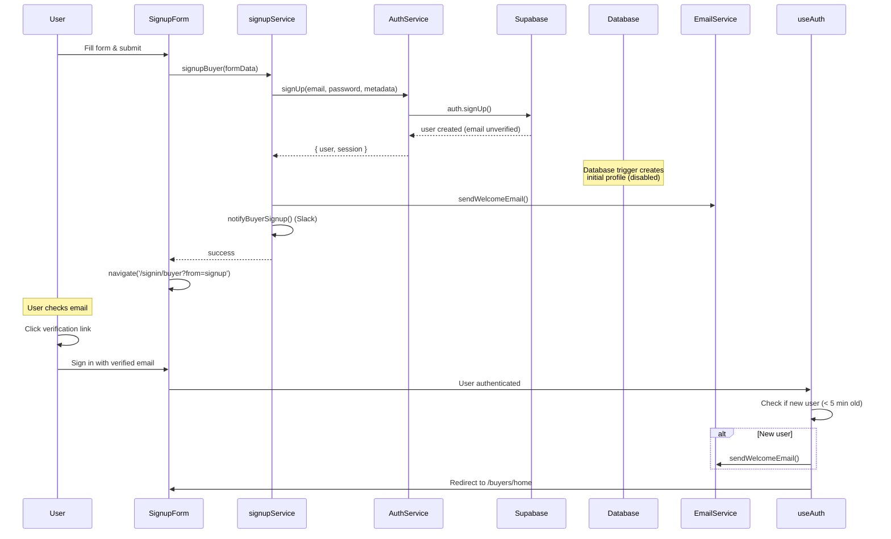
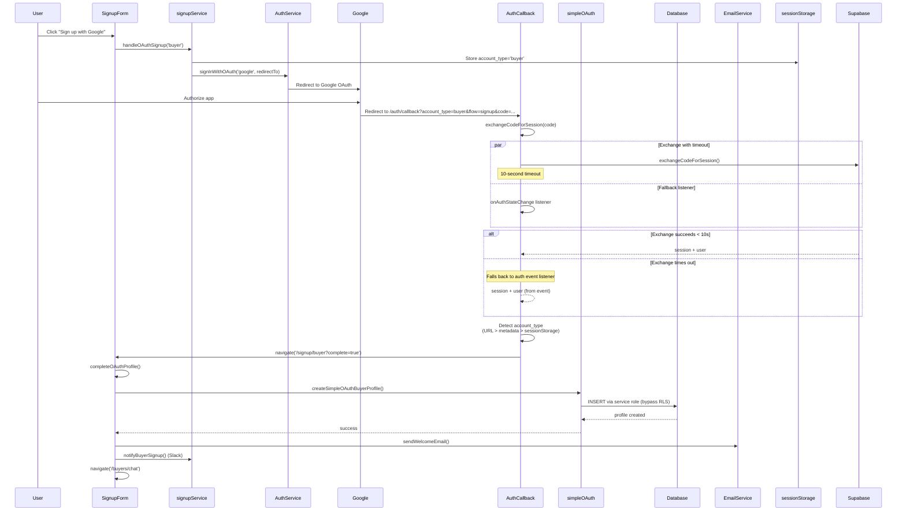
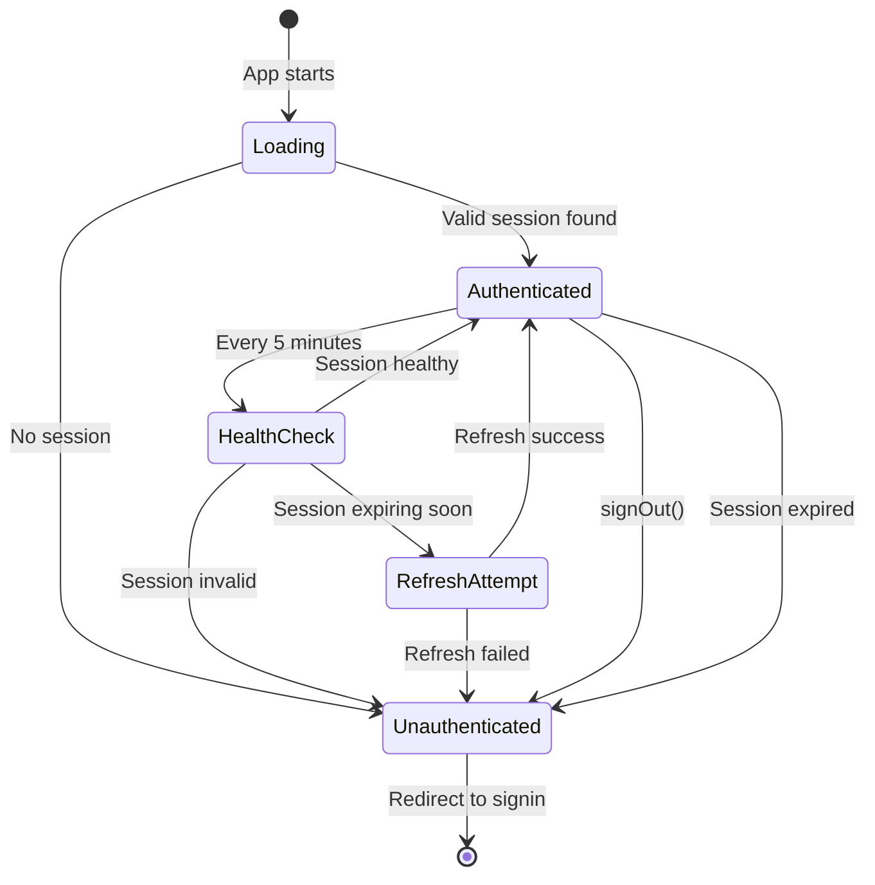
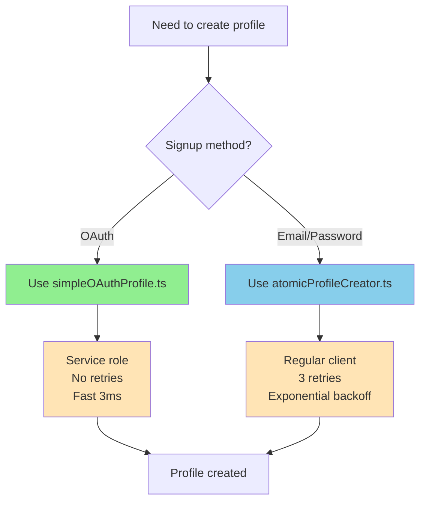

# Authentication System Architecture

**Last Updated**: 2025-10-03
**Status**: ✅ Production

---

## 📋 Table of Contents

1. [Overview](#overview)
2. [Email Signup Flow](#email-signup-flow)
3. [OAuth Signup Flow](#oauth-signup-flow)
4. [Session Management](#session-management)
5. [Profile Creation Decision Tree](#profile-creation-decision-tree)
6. [Component Architecture](#component-architecture)
7. [Troubleshooting Guide](#troubleshooting-guide)

---

## Overview

The KStoryBridge authentication system supports two account types (buyers and creators) through two signup methods (email/password and OAuth). The system is built on Supabase Auth with custom profile management and session handling.

### Key Components

- **useAuth Context** (`/hooks/useAuth.tsx`) - Central auth state management
- **AuthService** (`/services/auth/AuthService.ts`) - Auth operations singleton
- **Profile Creators** - Two systems for different use cases:
  - `simpleOAuthProfile.ts` - Fast OAuth profile creation
  - `atomicProfileCreator.ts` - Retry logic for email signup
- **ProtectedRoute** (`/components/ProtectedRoute.tsx`) - Route protection
- **Session Manager** (`/utils/sessionManager.ts`) - Session health checks

### Account Types

| Type | Description | Dashboard Route |
|------|-------------|-----------------|
| **Buyer** | Media buyers, producers, studios | `/buyers/home` |
| **Creator** | Content creators, IP owners | `/creators/home` |

---

## Email Signup Flow

### Buyer Email Signup



### Creator Email Signup

Same flow as buyer, but:
- Calls `signupService.signupCreator()` instead
- Creates profile in `user_creators` table
- Redirects to `/creators/home`

### Key Points

- ✅ Email verification required before signin
- ✅ Database triggers disabled (manual profile creation)
- ✅ Welcome email sent after signup (via signupService)
- ✅ Slack notification sent for new signups
- ⚠️ **Duplicate welcome email risk**: useAuth also tries to send (Task 1.1)

---

## OAuth Signup Flow

### Google OAuth Signup (Buyer)



### OAuth Timeout Handling

The OAuth callback uses a **dual-strategy approach**:

1. **Primary**: `exchangeCodeForSession()` with 10-second timeout
2. **Fallback**: `onAuthStateChange` event listener

**Why?**
- OAuth PKCE flows can take 5-10 seconds in production
- Fallback ensures signup never hangs
- Both strategies eventually succeed

**Log Messages**:
```
✅ Exchange promise resolved: user@example.com
OR
ℹ️ Exchange took longer than 10s, using auth state change event (this is normal)...
✅ OAuth session established for: user@example.com
```

### Key Points

- ✅ Service role used for profile creation (bypasses RLS timing issues)
- ✅ Account type passed via URL parameter
- ✅ Fallback to sessionStorage and metadata
- ✅ 10-second timeout prevents hangs
- ⚠️ **No email verification** for OAuth users

---

## Session Management

### Session Lifecycle



### Session Health Checks

**Performed by**: `performSessionHealthCheck()` in `sessionManager.ts`

**Checks**:
- ✅ Access token length (>20 characters)
- ✅ Token doesn't contain suspicious patterns
- ✅ User data present (id, email)
- ✅ Expiration time (warns if < 5 minutes)

**Frequency**:
- Initial load: After session retrieved
- Periodic: Every 5 minutes (via useAuth)
- Navigation: On protected route entry (30s throttle)

**Actions on Failure**:
- Invalid session → Sign out user
- Expiring soon → Attempt refresh
- Refresh failed → Sign out user

### Protected Routes

**Component**: `ProtectedRoute.tsx`

**Flow**:
```
1. Check if user authenticated
2. If not, check for auth tokens in URL
3. If no tokens, redirect to /signin
4. If authenticated, perform health check (throttled)
5. If health check fails, sign out
6. Render children
```

**Throttling**:
- Health check only runs once per 30 seconds per route
- Prevents excessive database queries
- Still catches session expiry

---

## Profile Creation Decision Tree

### When to Use Which System?



### simpleOAuthProfile.ts

**Use for**: OAuth signup flows ONLY

**Features**:
- ✅ Uses Supabase service role (bypasses RLS)
- ✅ Fast 3ms execution
- ✅ No retry logic
- ✅ Optimized for OAuth callback timing

**Example**:
```typescript
import { createSimpleOAuthBuyerProfile } from '@/services/simpleOAuthProfile';

const result = await createSimpleOAuthBuyerProfile({
  id: user.id,
  email: user.email,
  full_name: user.user_metadata.full_name,
  buyer_company: user.user_metadata.buyer_company,
  buyer_role: user.user_metadata.buyer_role,
  tier: 'basic'
});
```

### atomicProfileCreator.ts

**Use for**: Email signup, fallback scenarios, retry logic needed

**Features**:
- ✅ Race condition protection
- ✅ 3 retry attempts with exponential backoff
- ✅ Conflict resolution
- ✅ Uses regular Supabase client (RLS applies)

**Example**:
```typescript
import { createBuyerProfileAtomic } from '@/utils/atomicProfileCreator';

const result = await createBuyerProfileAtomic({
  id: user.id,
  email: user.email,
  full_name: formData.full_name,
  buyer_company: formData.buyer_company,
  buyer_role: formData.buyer_role,
  tier: 'basic'
}, {
  maxRetries: 3,
  allowUpdate: true
});
```

---

## Component Architecture

### Core Auth Components

```
src/
├── hooks/
│   └── useAuth.tsx                      # Central auth context
├── services/
│   ├── auth/
│   │   ├── AuthService.ts               # Auth operations singleton
│   │   ├── SessionService.ts            # Session state (to be deprecated)
│   │   └── ProfileService.ts            # Profile operations
│   ├── simpleOAuthProfile.ts            # OAuth profile creation
│   └── oauthProfileService.ts           # Deprecated wrapper (Phase 2)
├── utils/
│   ├── atomicProfileCreator.ts          # Retry-based profile creation
│   ├── sessionManager.ts                # Session health checks
│   └── simpleAccountTypeDetection.ts    # OAuth account type
├── components/
│   ├── auth/
│   │   ├── SignupFormContainer.tsx      # Signup form logic
│   │   └── signupService.ts             # Signup orchestration
│   └── ProtectedRoute.tsx               # Route protection
└── pages/
    ├── SignupPage.tsx                   # Buyer/creator signup
    ├── SigninPageSimple.tsx             # Signin page
    └── AuthCallbackSimple.tsx           # OAuth callback handler
```

### Data Flow

**Signup**:
```
User Input → SignupFormContainer → signupService → AuthService → Supabase
                                                  ↓
                                            Profile Creator → Database
                                                  ↓
                                            EmailService → Welcome Email
```

**OAuth**:
```
User Click → OAuth Provider → Callback → Account Type Detection
                                            ↓
                                       simpleOAuthProfile
                                            ↓
                                    Profile Created → Welcome Email
```

**Session**:
```
App Start → useAuth → getCurrentSession → Session Health Check
                                            ↓
                                      Periodic Checks (5 min)
                                            ↓
                                      Protected Routes
```

---

## Troubleshooting Guide

### Common Issues

#### 1. OAuth Signup Hangs or Times Out

**Symptoms**:
- User stuck on callback page
- "Exchange timeout" warning in console

**Causes**:
- PKCE flow taking >10 seconds
- Network issues
- Supabase slow response

**Solutions**:
- ✅ Normal behavior - fallback will handle it
- ✅ Check console for "✅ OAuth session established"
- ⚠️ If persists >30s, check network/Supabase status

**Code Location**: `AuthCallbackSimple.tsx` lines 84-105

---

#### 2. Duplicate Welcome Emails

**Symptoms**:
- User receives 2 welcome emails
- One from signup, one from signin

**Causes**:
- ⚠️ **KNOWN ISSUE** (Task 1.1 in remediation plan)
- Welcome email sent from 2 places:
  1. `signupService.ts` (correct)
  2. `useAuth.tsx` (should be removed)

**Solutions**:
- 🔧 **In Progress**: Phase 1 Task 1.1 will fix this
- Temporary: Email Service has deduplication

**Code Locations**:
- `signupService.ts` lines 79-102, 133-155
- `useAuth.tsx` lines 227-253 (to be removed)

---

#### 3. Profile Creation Fails During OAuth

**Symptoms**:
- OAuth signin succeeds but profile not created
- RLS policy violation error

**Causes**:
- Service role not configured
- RLS policies timing issue
- Missing metadata

**Solutions**:
1. Verify service role key in env vars
2. Check `simpleOAuthProfile.ts` logs
3. Ensure metadata passed in OAuth redirectTo

**Code Location**: `simpleOAuthProfile.ts` lines 23-109

---

#### 4. Session Expires Too Quickly

**Symptoms**:
- User logged out unexpectedly
- "Session expired" message

**Causes**:
- Supabase default: 1 hour expiry
- No auto-refresh
- Health check too aggressive

**Solutions**:
1. Check session expiry: `sessionManager.ts` line 106-116
2. Verify refresh logic: `useAuth.tsx` line 296-321
3. Adjust health check interval if needed (currently 5 min)

**Code Locations**:
- Session config: `useAuth.tsx` line 287
- Health check: `useAuth.tsx` line 263-287

---

#### 5. "No active session found" Error

**Symptoms**:
- User can't access protected pages
- Redirected to signin immediately

**Causes**:
- Session not initialized
- Cookies/localStorage cleared
- ProtectedRoute triggered too early

**Solutions**:
1. Check browser console for auth initialization logs
2. Verify localStorage has `sb-*-auth-token`
3. Check ProtectedRoute loading state

**Code Locations**:
- Session init: `useAuth.tsx` lines 96-195
- Protected route: `ProtectedRoute.tsx` lines 17-59

---

### Debugging Tips

**Enable verbose logging**:
```typescript
// In browser console
localStorage.setItem('VITE_AUTH_DEBUG', 'true');
```

**Key log messages to look for**:
- `🚀 AUTH: Initializing authentication`
- `✅ AUTH: Found valid existing session`
- `✅ OAuth session established for:`
- `🏥 AUTH: Session health check result:`

**Common log prefixes**:
- `🚀` - Starting operation
- `✅` - Success
- `⚠️` - Warning (may not be error)
- `❌` - Error
- `🔍` - Debug information
- `ℹ️` - Info (normal behavior)

---

### Where to Add Logging

**For auth operations**:
- `AuthService.ts` - Auth methods (signup, signin, OAuth)
- `signupService.ts` - Signup orchestration
- `useAuth.tsx` - Context state changes

**For session issues**:
- `sessionManager.ts` - Health checks
- `ProtectedRoute.tsx` - Route protection
- `useAuth.tsx` - Session refresh

**For profile creation**:
- `simpleOAuthProfile.ts` - OAuth profiles
- `atomicProfileCreator.ts` - Email signup profiles

---

## Additional Resources

- **Remediation Plan**: `/AUTH_SYSTEM_REMEDIATION_PLAN.md`
- **Auth Documentation**: `/AUTH_DOCUMENTATION.md`
- **User Journey Map**: `/USER_JOURNEY_MAP.md`
- **Database Schema**: `/DATABASE_SCHEMA.md`
- **CLAUDE.md**: Project-specific auth guidance

---

**Last Updated**: 2025-10-03
