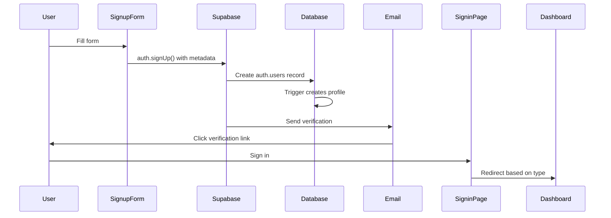
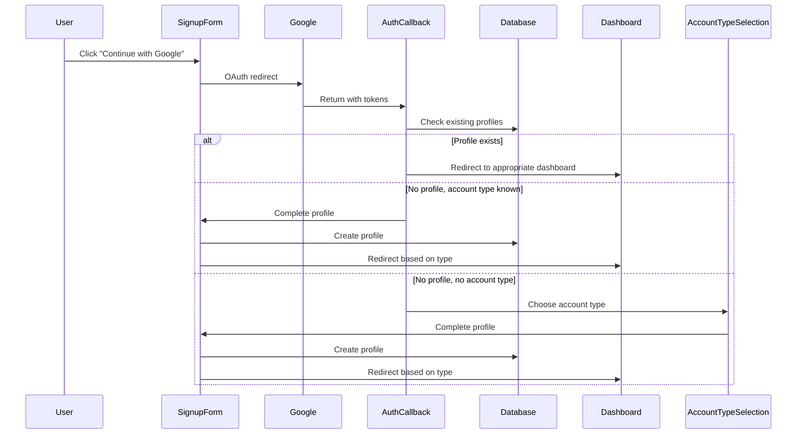

# KStoryBridge Authentication Documentation

**Last Updated:** 2025-09-12  
**Version:** 3.0 - Consolidated Documentation

This is the single source of truth for all authentication-related information in the KStoryBridge platform.

## Table of Contents

1. [System Architecture](#system-architecture)
2. [Database Schema](#database-schema)
3. [Authentication Flows](#authentication-flows)
4. [Technical Implementation](#technical-implementation)
5. [User Journeys](#user-journeys)
6. [Development & Testing](#development--testing)
7. [Troubleshooting](#troubleshooting)
8. [Migration History](#migration-history)

---

## System Architecture

### Overview

KStoryBridge uses a **dual-user authentication system** with a **split-app architecture**:

- **Website App** (`kstorybridge.com`): Marketing pages only
- **Dashboard App** (`dashboard.kstorybridge.com`): ALL authentication + user dashboard

### User Types

#### Buyers
- **Purpose**: Media buyers, producers, executives seeking Korean content
- **Email Requirement**: Work emails only (personal domains blocked)
- **Default Tier**: `basic` (changed from `invited` on 2025-08-21)
- **Routing**: `/buyers/home` (changed from `/buyers/titles` on 2025-09-12)

#### Creators (formerly IP Owners)
- **Purpose**: Content creators, authors, agents sharing their work
- **Email Requirement**: Any email allowed
- **Default Status**: `invited` (requires approval)
- **Routing**: `/creators/home`

### Supported Authentication Methods

1. **Email/Password**: Standard form-based with email verification
2. **OAuth (Google)**: One-click signup/signin with profile completion

### Environment Configuration

```bash
# Development
Dashboard: http://localhost:8081
Website: http://localhost:5173

# Production
Dashboard: https://dashboard.kstorybridge.com
Website: https://kstorybridge.com

# Supabase
SUPABASE_URL: https://dlrnrgcoguxlkkcitlpd.supabase.co
SUPABASE_ANON_KEY: eyJhbGciOiJIUzI1NiIsInR5cCI6IkpXVCJ9...
```

---

## Database Schema

### Core Tables

#### auth.users (Supabase Auth)
- Managed by Supabase
- Stores authentication credentials
- `raw_user_meta_data` contains account type and profile data

#### user_buyers
```sql
CREATE TABLE public.user_buyers (
  id uuid PRIMARY KEY REFERENCES auth.users(id),
  email text NOT NULL UNIQUE,
  full_name text NOT NULL,
  buyer_company text,
  buyer_role buyer_role, -- ENUM: producer|executive|agent|content_scout|other
  linkedin_url text,
  tier user_tier DEFAULT 'basic', -- ENUM: basic|invited|pro|suite
  created_at timestamptz DEFAULT now(),
  updated_at timestamptz DEFAULT now()
);
```

#### user_creators (migrated from user_ipowners)
```sql
CREATE TABLE public.user_creators (
  id uuid PRIMARY KEY REFERENCES auth.users(id),
  email text NOT NULL UNIQUE,
  full_name text NOT NULL,
  pen_name text, -- IMPORTANT: Always use pen_name field
  ip_owner_role ip_owner_role, -- ENUM: author|agent
  ip_owner_company text,
  website_url text,
  invitation_status text DEFAULT 'invited',
  created_at timestamptz DEFAULT now(),
  updated_at timestamptz DEFAULT now()
);
```

### Tier System (Buyers)

```typescript
const tierHierarchy = {
  basic: 1,    // Default, standard features
  invited: 0,  // Restricted (legacy)
  pro: 2,      // Premium content
  suite: 3     // Full access
};
```

### Database Triggers

**Consolidated Trigger (2025-09-10)**:
```sql
CREATE TRIGGER on_auth_user_profile_routing
  AFTER INSERT ON auth.users
  FOR EACH ROW 
  EXECUTE FUNCTION public.handle_user_profile_routing();
```

The trigger automatically creates the appropriate profile based on `account_type` metadata.

### Query Patterns

**CRITICAL**: Always query by `email`, never by `user_id`:
```typescript
// ✅ CORRECT
.eq('email', user.email?.toLowerCase())

// ❌ INCORRECT - user_id doesn't exist
.eq('user_id', user.id)
```

---

## Authentication Flows

### Email/Password Signup



### OAuth Signup



### Universal Signin

```typescript
// Signin flow logic
1. Authenticate user (email/password or OAuth)
2. Check user_metadata.account_type
3. If not found, query both user tables
4. Determine account type and tier/status
5. Redirect accordingly:
   - Buyer (basic/pro/suite) → /buyers/home (default login redirect)
   - Buyer (invited) → /invited
   - Creator (accepted) → /creators/home
   - Creator (invited) → /creator/invited
```

---

## Technical Implementation

### Key Components

#### Authentication Pages (Dashboard App)
- `/signin` - Universal signin
- `/signup/buyer` - Buyer signup
- `/signup/creator` - Creator signup
- `/auth/callback` - OAuth callback handler
- `/account-type-selection` - Account type selection for OAuth users without existing accounts
- `/forgot-password` - Password reset

#### Core Hooks & Utilities
- `useAuth.tsx` - Authentication state management
- `useAccountType.tsx` - Account type detection
- `accountTypeDetection.ts` - Centralized detection logic
- `useTierAccess.tsx` - Buyer tier access control

### Account Type Detection Priority

1. **User Metadata** (highest - OAuth flows)
2. **Database Lookup** (existing users)
3. **URL Parameters** (signup flows)
4. **SessionStorage** (OAuth edge cases)
5. **Default to 'buyer'** (backward compatibility)

### Route Protection

```typescript
// Protection hierarchy
<ProtectedRoute>
  <AccountTypeProtectedRoute allowedAccountTypes={['creator']}>
    <CMSLayout>
      {children}
    </CMSLayout>
  </AccountTypeProtectedRoute>
</ProtectedRoute>
```

### Session Management

**Cross-Domain Authentication**:
```typescript
// Dashboard receives tokens via URL
const urlParams = new URLSearchParams(window.location.search);
if (urlParams.has('access_token')) {
  await supabase.auth.setSession({
    access_token: urlParams.get('access_token'),
    refresh_token: urlParams.get('refresh_token'),
    // ...
  });
}
```

### Email Validation (Buyers)

```typescript
const consumerEmailProviders = [
  'gmail.com', 'yahoo.com', 'hotmail.com', 
  'outlook.com', 'aol.com', 'icloud.com', 
  // ... more personal domains
];

// Block personal emails for buyers
if (accountType === 'buyer' && consumerEmailProviders.includes(emailDomain)) {
  throw new Error('Please use a work email address');
}
```

---

## User Journeys

### New Buyer Journey

#### Email Signup
1. Visit `/signup/buyer`
2. Enter work email + company details
3. Receive verification email
4. Verify email
5. Sign in → Dashboard (`/buyers/home`)

#### OAuth Signup
1. Visit `/signup/buyer`
2. Click "Continue with Google"
3. Authenticate with Google
4. Complete profile (company, role)
5. Access dashboard immediately

### New Creator Journey

#### Email Signup
1. Visit `/signup/creator`
2. Enter email (any) + pen name
3. Receive verification email
4. Verify email
5. Sign in → Pending page (`/creator/invited`)

#### OAuth Signup
1. Visit `/signup/creator`
2. Click "Continue with Google"
3. Complete profile (pen name, role)
4. Access pending page

### OAuth User Without Existing Account Journey (NEW)

#### First-time OAuth Signin
1. User attempts to sign in with Google but has no existing KStoryBridge account
2. OAuth callback detects no account type and no existing profile
3. User is redirected to `/account-type-selection` page
4. User sees clear options to choose between Media Buyer or Content Creator
5. After selection, user is redirected to appropriate signup completion page
6. Complete profile information (company details for buyers, pen name for creators)
7. Access appropriate dashboard based on account type

**Note**: This prevents the previous behavior where unknown OAuth users were automatically assigned as buyers.

### Returning User Journey

1. Visit `/signin`
2. Enter credentials or use OAuth
3. System detects account type
4. Redirect to appropriate dashboard

---

## Development & Testing

### Local Setup

```bash
# Install dependencies
npm install

# Start apps
npm run dev:website    # localhost:5173
npm run dev:dashboard  # localhost:8081

# Environment variables (.env.local)
VITE_DASHBOARD_URL=http://localhost:8081
VITE_WEBSITE_URL=http://localhost:5173
VITE_AUTH_DEBUG=true  # Enable debug logging
```

### Testing Checklist

#### Email Signup
- [ ] Buyer with work email
- [ ] Buyer with personal email (should fail)
- [ ] Creator with any email
- [ ] Email verification flow
- [ ] Password requirements validation

#### OAuth Signup
- [ ] Google OAuth initiation
- [ ] Profile completion
- [ ] Email domain validation (buyers)
- [ ] Session establishment

#### Signin
- [ ] Email/password signin
- [ ] Google OAuth signin
- [ ] Account type detection
- [ ] Correct routing based on tier/status

#### Cross-Domain
- [ ] Website → Dashboard redirect
- [ ] Session token transfer
- [ ] URL parameter handling

### Debug Commands

```javascript
// Check current user
const { data: { user } } = await supabase.auth.getUser();
console.log('User:', user);

// Check profiles
const buyer = await supabase.from('user_buyers').select('*').eq('email', email);
const creator = await supabase.from('user_creators').select('*').eq('email', email);

// Check account type
console.log('Account type:', user.user_metadata?.account_type);

// Enable debug logging
localStorage.setItem('auth_debug', 'true');
```

---

## Troubleshooting

### Common Issues

#### "User redirected to wrong page after login"
- Check `tier` field in `user_buyers` table
- Check `invitation_status` in `user_creators` table
- Verify account type detection logic

#### "OAuth signup fails with personal email"
- Expected behavior for buyers
- User must use work email
- Check `consumerEmailProviders` list

#### "Profile not created after signup"
- Check database trigger is active
- Verify metadata contains `account_type`
- Check RLS policies

#### "Password reset link doesn't work"
- Check for expired tokens
- Verify hash parameter parsing
- Check email delivery (spam folder)

### SQL Debugging Queries

```sql
-- Check user profiles
SELECT 
  au.email,
  au.raw_user_meta_data->>'account_type' as account_type,
  ub.tier as buyer_tier,
  uc.invitation_status as creator_status
FROM auth.users au
LEFT JOIN user_buyers ub ON ub.id = au.id
LEFT JOIN user_creators uc ON uc.id = au.id
WHERE au.email = 'user@example.com';

-- Find duplicate profiles
SELECT email FROM user_creators 
INTERSECT 
SELECT email FROM user_buyers;

-- Check triggers
SELECT trigger_name, event_object_table 
FROM information_schema.triggers 
WHERE trigger_schema = 'auth';
```

---

## Migration History

### Major Changes

#### 2025-01-17: OAuth Account Type Selection Enhancement
- **BREAKING CHANGE**: OAuth signin no longer defaults to buyer account type
- Added `/account-type-selection` page for OAuth users without existing accounts
- Updated `AuthCallbackPage` to redirect to account type selection when no account type is determined
- Enhanced user experience by explicitly asking users to choose their account type
- Prevents automatic buyer account creation for unknown users

#### 2025-09-12: Buyer Login Redirect Change
- Changed default buyer login redirect from `/buyers/titles` to `/buyers/home`
- Provides better onboarding experience with dashboard overview

#### 2025-09-10: Account Type Standardization
- Renamed `user_ipowners` → `user_creators`
- Standardized account types to `buyer` and `creator`
- Consolidated multiple triggers into one
- Fixed RLS policies

#### 2025-08-21: Default Tier Change
- Changed default buyer tier from `invited` to `basic`
- New signups get immediate dashboard access

#### 2025-08-16: OAuth Email Validation
- Added work email validation for buyer OAuth signups
- Improved error messaging

### Resolved Issues

1. **Table Name Inconsistency** ✅
   - Migration from `user_ipowners` to `user_creators` complete

2. **Duplicate Profile Creation** ✅
   - Consolidated triggers prevent duplicates

3. **Session Management** ✅
   - Enhanced token validation and recovery

4. **Performance Issues** ✅
   - Implemented caching for tier access
   - Reduced database queries by 70-80%

---

## Best Practices

### Development Guidelines

1. **Always use `pen_name`** field for creator profiles
2. **Query by `email`**, never by `user_id`
3. **Test both email and OAuth** flows
4. **Enable debug logging** during development
5. **Check for existing profiles** before creation

### Security Considerations

1. **Validate email domains** for buyer accounts
2. **Use RLS policies** for data access
3. **Sanitize URL parameters** in cross-domain flows
4. **Clear sensitive data** from sessionStorage
5. **Monitor failed authentication** attempts

### Performance Optimization

1. **Use TierProvider** for tier-gated content
2. **Cache account type** detection results
3. **Minimize database queries** with context providers
4. **Batch profile lookups** when possible

---

## Quick Reference

### File Locations

```
/apps/dashboard/src/
├── pages/
│   ├── SigninPage.tsx
│   ├── SignupPage.tsx
│   ├── BuyerSignupPage.tsx
│   ├── CreatorSignupPage.tsx
│   ├── AuthCallbackPage.tsx
│   └── AccountTypeSelectionPage.tsx
├── hooks/
│   ├── useAuth.tsx
│   └── useTierAccess.tsx
└── utils/
    └── accountTypeDetection.ts

/supabase/
├── migrations/
│   └── [migration files]
└── functions/
    └── create-creator-profile/
```

### Environment Variables

```bash
# Required
VITE_SUPABASE_URL
VITE_SUPABASE_ANON_KEY
VITE_DASHBOARD_URL
VITE_WEBSITE_URL

# Optional (Development)
VITE_AUTH_DEBUG=true
VITE_LOCAL_TESTING=true
VITE_OAUTH_TESTING=true
```

### Important URLs

- **Dashboard Dev**: http://localhost:8081
- **Website Dev**: http://localhost:5173
- **Dashboard Prod**: https://dashboard.kstorybridge.com
- **Website Prod**: https://kstorybridge.com
- **Supabase Dashboard**: https://app.supabase.com/project/dlrnrgcoguxlkkcitlpd

---

**Note**: This document is the single source of truth for authentication. All app-specific CLAUDE.md files should reference this document for auth-related information.