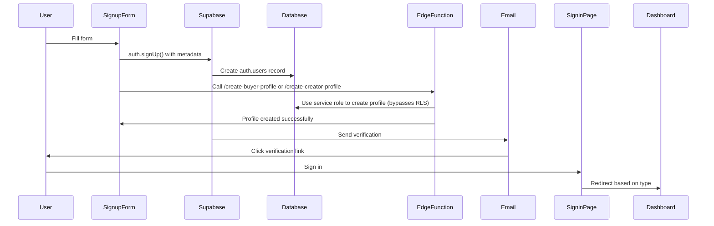
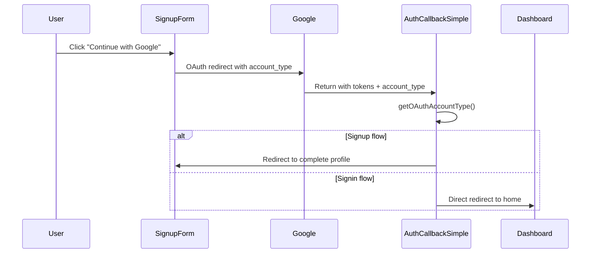

# KStoryBridge Authentication Documentation

**Last Updated:** 2025-10-11
**Version:** 3.7 - Email Signup Edge Function Migration

This is the single source of truth for all authentication-related information in the KStoryBridge platform.

## Table of Contents

1. [⚠️ Critical Authentication Rules](#️-critical-authentication-rules-do-not-violate)
2. [System Architecture](#system-architecture)
3. [Database Schema](#database-schema)
4. [Authentication Flows](#authentication-flows)
5. [Technical Implementation](#technical-implementation)
6. [User Journeys](#user-journeys)
7. [Development & Testing](#development--testing)
8. [Troubleshooting](#troubleshooting)
9. [Migration History](#migration-history)

---

## ⚠️ Critical Authentication Rules (DO NOT VIOLATE)

**Added:** 2025-10-05
**Purpose:** Prevent future code changes from breaking authentication

### Profile Existence Check Philosophy

**CORE PRINCIPLE**: Users in `auth.users` without profiles in `user_buyers`/`user_creators` are treated as **"no account"**

#### RULE 1: NEVER Auto-Create Profiles During Signin

❌ **FORBIDDEN** - Auto-creating profiles:
```typescript
// DO NOT DO THIS - bypasses signup flow
if (!profileExists) {
  await createBuyerProfile(user);  // ❌ WRONG
  await createCreatorProfile(user); // ❌ WRONG
  navigate('/dashboard');
}
```

✅ **CORRECT** - Show error and redirect to signup:
```typescript
// Enforce signup requirement
if (!profileExists) {
  toast({
    title: "Account Not Found",
    description: "Your account doesn't exist. Please sign up first.",
    variant: "destructive"
  });
  navigate('/signup/buyer');
}
```

**WHY**: OAuth signin can create users in `auth.users` even if they haven't completed signup. Auto-creating profiles bypasses the signup flow and creates incomplete accounts with missing required fields.

**WHERE THIS IS ENFORCED** (as of 2025-10-05):
- `apps/dashboard/src/pages/AuthCallbackSimple.tsx` (lines 169-224)
- `apps/dashboard/src/components/SigninForm.tsx` (lines 171-211)
- `apps/dashboard/src/pages/Profile.tsx` (lines 192-205, 240-253)

---

#### RULE 2: Pass Data via URL Query Parameters (NOT OAuth State)

**The Critical Distinction**:
- ✅ **URL query parameters in redirectTo** - CORRECT, reliable, standard practice
- ❌ **OAuth state parameter via queryParams** - WRONG, conflicts with Supabase PKCE

---

✅ **CORRECT** - URL query parameters in redirectTo URL:
```typescript
// Store in sessionStorage as backup
sessionStorage.setItem('oauth_account_type', accountType);
sessionStorage.setItem('oauth_flow', 'signin');

// Encode account_type and flow in redirect URL for reliable persistence
const callbackUrl = `${window.location.origin}/auth/callback?account_type=${accountType}&flow=signin`;
await supabase.auth.signInWithOAuth({
  provider: 'google',
  options: {
    redirectTo: callbackUrl  // URL params are part of the redirect URL
  }
});

// In callback handler - read from URL params (primary), sessionStorage (backup)
const urlParams = new URLSearchParams(window.location.search);
const accountType = urlParams.get('account_type') || sessionStorage.getItem('oauth_account_type');
const flow = urlParams.get('flow') || sessionStorage.getItem('oauth_flow');
```

❌ **FORBIDDEN** - OAuth state parameter:
```typescript
// Custom state parameter conflicts with Supabase PKCE
await supabase.auth.signInWithOAuth({
  provider: 'google',
  options: {
    redirectTo: callbackUrl,
    queryParams: { state: customState }  // ❌ WRONG - Breaks Supabase PKCE
  }
});
```

---

**WHY URL Parameters Work**:
1. **Survives all redirects**: URL params persist through Google → Supabase → Your App
2. **No PKCE conflict**: Supabase's internal `state` parameter is separate from your URL params
3. **Standard practice**: This is how OAuth redirect URLs are designed to work
4. **Reliable**: Works across domains, browsers, and devices

**WHY OAuth State Breaks**:
1. **Supabase manages PKCE state internally**: Uses `state` param for security
2. **Custom state overrides PKCE**: Causes `error_code=bad_oauth_state`
3. **OAuth hangs**: Validation fails, user stuck on callback page

**OAuth Flow Architecture**:
```
Your App (staging.kstorybridge.com/auth/callback?account_type=buyer&flow=signin)
  ↓ signInWithOAuth()
Supabase (dlrnrgcoguxlkkcitlpd.supabase.co)
  ↓ (adds internal PKCE state parameter)
Google OAuth
  ↓ (redirects with code + Supabase's state + YOUR URL params)
Supabase (validates its own state ✅)
  ↓ (redirects back to your app WITH your URL params intact)
Your App (staging.kstorybridge.com/auth/callback?account_type=buyer&flow=signin&code=xyz)
  ↓ Read account_type and flow from URL ✅
```

**WHERE THIS IS IMPLEMENTED** (as of 2025-10-05):
- Signin Flow: `apps/dashboard/src/components/SigninForm.tsx` (lines 95-108)
- Signup Flow: `apps/dashboard/src/components/auth/signupService.ts` (lines 367-377)
- Callback Handler: `apps/dashboard/src/pages/AuthCallbackSimple.tsx` (lines 35-46)

---

#### RULE 3: Profile Tables Are Source of Truth for "Has Account"

**Two-Table Authentication Model**:
```
auth.users = OAuth identity verified (auto-created by Supabase)
user_buyers / user_creators = Signup completed (profile exists)

Valid Account = EXISTS in auth.users AND EXISTS in profile table
```

**Profile Check Pattern** (use everywhere access is granted):
```typescript
// Example: Check buyer profile existence
const { data: profile } = await supabase
  .from('user_buyers')
  .select('id')
  .eq('id', user.id)
  .maybeSingle();

if (!profile) {
  // User exists in auth.users but hasn't completed signup
  toast({ description: "Your account doesn't exist. Please sign up first." });
  navigate('/signup/buyer');
  return; // Block access
}

// Profile exists - grant access
navigate('/buyers/home');
```

**Why Incomplete Users Exist**:
- OAuth providers create `auth.users` entry on first signin (Supabase default behavior)
- This happens BEFORE our profile check
- These users cannot access the system (blocked by profile checks)
- They complete signup → profile created → future signins succeed

**Incomplete User Cleanup** (optional, not required):
```sql
-- Delete auth.users entries >7 days old with no profile
DELETE FROM auth.users u
WHERE u.created_at < NOW() - INTERVAL '7 days'
AND NOT EXISTS (SELECT 1 FROM user_buyers WHERE id = u.id)
AND NOT EXISTS (SELECT 1 FROM user_creators WHERE id = u.id);
```

---

## System Architecture

### Overview

KStoryBridge uses a **dual-user authentication system** with a **split-app architecture**:

- **Website App** (`kstorybridge.com`): Marketing pages only
- **Dashboard App** (`dashboard.kstorybridge.com`): ALL authentication + user dashboard

### User Types

#### Buyers
- **Purpose**: Media buyers, producers, executives seeking Korean content
- **Email Requirement**: Work emails only (personal domains blocked)
- **Default Tier**: `basic` (changed from `invited` on 2025-08-21)
- **Routing**: `/buyers/chat` (primary dashboard, `/buyers/home` redirects here)

#### Creators (formerly IP Owners)
- **Purpose**: Content creators, authors, agents sharing their work
- **Email Requirement**: Any email allowed
- **Default Status**: `invited` (requires approval)
- **Routing**: `/creators/home`

### Supported Authentication Methods

1. **Email/Password**: Standard form-based with email verification
2. **OAuth (Google)**: One-click signup/signin with profile completion

### Environment Configuration

```bash
# Development
Dashboard: http://localhost:8081
Website: http://localhost:5173

# Production
Dashboard: https://dashboard.kstorybridge.com
Website: https://kstorybridge.com

# Supabase
SUPABASE_URL: https://dlrnrgcoguxlkkcitlpd.supabase.co
SUPABASE_ANON_KEY: eyJhbGciOiJIUzI1NiIsInR5cCI6IkpXVCJ9...
```

---

## Database Schema

### Core Tables

#### auth.users (Supabase Auth)
- Managed by Supabase
- Stores authentication credentials
- `raw_user_meta_data` contains account type and profile data

#### user_buyers
```sql
CREATE TABLE public.user_buyers (
  id uuid PRIMARY KEY REFERENCES auth.users(id),
  email text NOT NULL UNIQUE,
  full_name text NOT NULL,
  buyer_company text,
  buyer_role buyer_role, -- ENUM: producer|executive|agent|content_scout|other
  linkedin_url text,
  tier user_tier DEFAULT 'basic', -- ENUM: basic|invited|pro|suite
  created_at timestamptz DEFAULT now(),
  updated_at timestamptz DEFAULT now()
);
```

#### user_creators (migrated from user_ipowners)
```sql
CREATE TABLE public.user_creators (
  id uuid PRIMARY KEY REFERENCES auth.users(id),
  email text NOT NULL UNIQUE,
  full_name text NOT NULL,
  pen_name text, -- IMPORTANT: Always use pen_name field
  ip_owner_role ip_owner_role NOT NULL, -- ENUM: author|agent (REQUIRED as of 2025-09-21)
  ip_owner_company text,
  website_url text,
  invitation_status text DEFAULT 'invited', -- ENUM: invited|active|pending
  created_at timestamptz DEFAULT now(),
  updated_at timestamptz DEFAULT now()
);
```

**CRITICAL CHANGES (2025-09-21)**:
- `ip_owner_role` is now **REQUIRED** for all creator signups
- `invitation_status` field added to profile management
- Default role selection: 'author' (if not specified during signup)

### Tier System (Buyers)

```typescript
const tierHierarchy = {
  basic: 1,    // Default, standard features
  invited: 0,  // Restricted (legacy)
  pro: 2,      // Premium content
  suite: 3     // Full access
};
```

### Database Triggers

**Consolidated Trigger (2025-09-10)**:
```sql
CREATE TRIGGER on_auth_user_profile_routing
  AFTER INSERT ON auth.users
  FOR EACH ROW 
  EXECUTE FUNCTION public.handle_user_profile_routing();
```

The trigger automatically creates the appropriate profile based on `account_type` metadata.

### Query Patterns

**CRITICAL**: Always query by `email`, never by `user_id`:
```typescript
// ✅ CORRECT
.eq('email', user.email?.toLowerCase())

// ❌ INCORRECT - user_id doesn't exist
.eq('user_id', user.id)
```

---

## Authentication Flows

### Email/Password Signup (Updated 2025-10-11)



**Key Changes (2025-10-11)**:
- Email signup now uses edge functions for profile creation (consistent with OAuth)
- Edge function uses server-side service role to bypass RLS policies
- No more RLS 401 errors during signup (auth.uid() is NULL before email verification)
- Consistent architecture: Both OAuth and email signups use edge functions

### OAuth Signup (Simplified Flow - 2025-01-14)



**Key Simplifications**:
- **Single callback handler**: `AuthCallbackSimple.tsx` (270 lines, streamlined logic)
- **Fast account type detection**: `getOAuthAccountType()` - metadata-only, no database queries
- **Consistent redirect URLs**: Always `${window.location.origin}/auth/callback`
- **Session passing**: Eliminates 90s `getSession()` timeouts

**For implementation details, see**: [OAuth Flow Implementation](#oauth-implementation-changes-simplified---2025-01-14)

### Universal Signin

```typescript
// Signin flow logic
1. Authenticate user (email/password or OAuth)
2. Check user_metadata.account_type
3. If not found, query both user tables
4. Determine account type and tier/status
5. Redirect accordingly:
   - Buyer (basic/pro/suite) → /buyers/home (default login redirect)
   - Buyer (invited) → /invited
   - Creator (accepted) → /creators/home
   - Creator (invited) → /creator/invited
```

---

## Technical Implementation

### Key Components

#### Authentication Pages (Dashboard App)
- `/signin` - Universal signin
- `/signup/buyer` - Buyer signup
- `/signup/creator` - Creator signup
- `/auth/callback` - OAuth callback handler
- `/account-type-selection` - Account type selection for OAuth users without existing accounts
- `/forgot-password` - Password reset

#### Core Hooks & Utilities
- `useAuth.tsx` - Authentication state management
- `useAccountType.tsx` - Account type detection
- `simpleAccountTypeDetection.ts` - Fast metadata-only detection (replaced complex 700+ line system)
- `AuthCallbackSimple.tsx` - Streamlined OAuth callback handler
- `oauthProfileEdgeFunction.ts` - OAuth profile creation via edge functions
- `emailSignupEdgeFunction.ts` - Email signup profile creation via edge functions (Added 2025-10-11)
- `atomicProfileCreator.ts` - Retry/fallback logic ONLY (not for primary signup flows)
- `useTierAccess.tsx` - Buyer tier access control

### Account Type Detection Priority (Updated 2025-10-06)

**Streamlined approach in OAuth callback**:

1. **URL Parameters** (highest priority - from OAuth redirect)
   ```typescript
   const accountType = urlParams.get('account_type');
   ```

2. **User Metadata** (OAuth auth.users.raw_user_meta_data)
   ```typescript
   user.user_metadata?.account_type
   ```

3. **SessionStorage** (fallback for edge cases)
   ```typescript
   sessionStorage.getItem('oauth_account_type')
   ```

4. **Validation & Error** (NO default assignment)
   ```typescript
   if (!finalAccountType || (finalAccountType !== 'buyer' && finalAccountType !== 'creator')) {
     navigate(`/account-type-selection?oauth=true&email=${user.email}`);
   }
   ```

**Performance Improvements**:
- **No database queries** during OAuth callback
- **Session passing** eliminates 90s `getSession()` timeouts
- **No default 'buyer' fallback** - explicit validation required
- **Consistent behavior** across all environments

### Route Protection

```typescript
// Protection hierarchy
<ProtectedRoute>
  <AccountTypeProtectedRoute allowedAccountTypes={['creator']}>
    <CMSLayout>
      {children}
    </CMSLayout>
  </AccountTypeProtectedRoute>
</ProtectedRoute>
```

### Session Management

**Cross-Domain Authentication**:
```typescript
// Dashboard receives tokens via URL
const urlParams = new URLSearchParams(window.location.search);
if (urlParams.has('access_token')) {
  await supabase.auth.setSession({
    access_token: urlParams.get('access_token'),
    refresh_token: urlParams.get('refresh_token'),
    // ...
  });
}
```

### OAuth Implementation (Updated 2025-10-05)

**SessionStorage Approach (CORRECT)**:

Supabase manages its own PKCE `state` parameter internally. We use **sessionStorage** to pass flow data because OAuth redirects stay on the same domain.

**OAuth Flow Architecture**:
```
Your App (staging.kstorybridge.com)
  ↓ signInWithOAuth()
Supabase (dlrnrgcoguxlkkcitlpd.supabase.co)
  ↓ (generates internal PKCE state)
Google OAuth
  ↓ (redirects with code + Supabase's state)
Supabase (validates its own state)
  ↓ (redirects back to your app)
Your App (staging.kstorybridge.com/auth/callback)
  ↓ sessionStorage still available (same domain!)
```

**Signin/Signup Implementation**:

```typescript
// ✅ CORRECT: Store in sessionStorage (SigninForm.tsx / signupService.ts)
sessionStorage.setItem('oauth_account_type', accountType);
sessionStorage.setItem('oauth_flow', 'signin'); // or 'signup'

const callbackUrl = `${window.location.origin}/auth/callback`;
await supabase.auth.signInWithOAuth({
  provider: 'google',
  options: {
    redirectTo: callbackUrl
    // NO queryParams needed - Supabase handles state internally
  }
});
```

**❌ FORBIDDEN Approaches**:

```typescript
// DON'T: Custom state parameter (conflicts with Supabase PKCE)
await supabase.auth.signInWithOAuth({
  provider: 'google',
  options: {
    redirectTo: callbackUrl,
    queryParams: { state: customState }  // ❌ Causes bad_oauth_state error
  }
});

// DON'T: URL query parameters (get stripped)
const callbackUrl = `${origin}/auth/callback?flow=signin`; // ❌ Parameters stripped
```

**OAuth Callback Flow (AuthCallbackSimple.tsx)** (Updated 2025-10-06):

```typescript
// 1. Exchange OAuth code for session
const urlParams = new URLSearchParams(window.location.search);
const code = urlParams.get('code');
const accountType = urlParams.get('account_type'); // From URL param
const flow = urlParams.get('flow'); // From URL param

const { data, error } = await supabase.auth.exchangeCodeForSession(code);
const user = data.session.user;

// 2. Determine account type (Priority: URL > metadata > sessionStorage)
const finalAccountType = (
  accountType ||  // From URL parameter (PRIMARY)
  user.user_metadata?.account_type ||
  sessionStorage.getItem('oauth_account_type')
) as AccountType | null;

// Validate account type (no default fallback)
if (!finalAccountType || (finalAccountType !== 'buyer' && finalAccountType !== 'creator')) {
  navigate(`/account-type-selection?oauth=true&email=${user.email}`);
  return;
}

// 3. Determine flow type
const finalFlow = (
  flow ||  // From URL parameter (PRIMARY)
  sessionStorage.getItem('oauth_flow') ||
  'signin'
) as 'signin' | 'signup';

// 4. Clear sessionStorage
sessionStorage.removeItem('oauth_account_type');
sessionStorage.removeItem('oauth_flow');

// 5. Check profile existence for signin flow
if (finalFlow === 'signin') {
  const profileExists = await checkProfileExists(user.id, finalAccountType);

  if (!profileExists) {
    toast({
      title: "Account Not Found",
      description: "Your account doesn't exist. Please sign up first.",
      variant: "destructive"
    });
    navigate(`/signup/${finalAccountType}`);
    return;
  }

  navigate(getDashboardPath(finalAccountType));
} else {
  // Signup flow - redirect to profile completion
  // Note: Metadata update happens in profile completion, not here
  navigate(`/signup/${finalAccountType}?complete=true&user_id=${user.id}&email=${user.email}`);
}
```

**Profile Completion Flow (signupService.ts)** (Added 2025-10-06):

```typescript
// In SignupFormContainer.tsx
const { user, session } = useAuth(); // Get session from context
const result = await completeOAuthProfile(accountType, formData, user, session);

// In signupService.ts (completeOAuthProfile)
export const completeOAuthProfile = async (
  accountType, formData, user, session? // Accept session parameter
) => {
  // Create profile via edge function (pass session to avoid getSession)
  const profileResult = await createOAuthProfileViaEdgeFunction(
    accountType, user.id, profileData, session // Pass session
  );

  // Update metadata using passed session (no getSession call!)
  if (session?.access_token) {
    await supabase.auth.updateUser({
      data: { account_type: accountType }
    });
  }

  return { success: true, user };
};
```

**Profile Existence Check**:

```typescript
async function checkProfileExists(userId: string, accountType: string): Promise<boolean> {
  try {
    if (accountType === 'buyer') {
      const { data } = await supabase
        .from('user_buyers')
        .select('id')
        .eq('id', userId)
        .maybeSingle();
      return !!data;
    } else {
      const { data } = await supabase
        .from('user_creators')
        .select('id')
        .eq('id', userId)
        .maybeSingle();
      return !!data;
    }
  } catch (error) {
    console.error('Error checking profile:', error);
    return false; // Assume no profile on error
  }
}
```

### Auth Metadata Management (Updated 2025-10-06)

**Email Signup Metadata**:
```typescript
// Creator signup with metadata
const result = await authService.signUp({
  email: formData.email,
  password: formData.password,
  metadata: {
    full_name: formData.full_name,
    pen_name: formData.pen_name,
    ip_owner_role: formData.ip_owner_role, // REQUIRED
    ip_owner_company: formData.ip_owner_company,
    website_url: formData.website_url,
    account_type: 'creator', // CRITICAL: Set during signup
    invitation_status: 'invited'
  }
});
```

**OAuth Metadata Update** (Updated 2025-10-06):
```typescript
// In signupService.ts (completeOAuthProfile function)
// Uses existing session - no getSession() call to avoid 90s timeout
if (session?.access_token) {
  await supabase.auth.updateUser({
    data: { account_type: 'buyer' } // Updates auth.users metadata
  });
}
```

**Note**: Metadata update moved from OAuth callback to profile completion to avoid session timeout issues. Session is passed from `useAuth()` to avoid calling `getSession()` which hangs for 90 seconds during OAuth completion.

**Key Metadata Fields**:
- `account_type`: 'buyer' | 'creator' (REQUIRED for routing)
- `full_name`: User's full name
- `pen_name`: Creator's pen name/studio name
- `ip_owner_role`: 'author' | 'agent' (REQUIRED for creators)
- `invitation_status`: 'invited' | 'active' | 'pending'

### Profile Creation Architecture (Updated 2025-10-11)

**Unified Edge Function Approach**:

All signup flows now use edge functions for profile creation to ensure consistent, secure, RLS-compliant operations:

```
OAuth Signup:   Browser → oauthProfileEdgeFunction.ts → /create-oauth-profile → Service Role → Profile ✅
Email Signup:   Browser → emailSignupEdgeFunction.ts → /create-buyer-profile → Service Role → Profile ✅
                                                       → /create-creator-profile → Service Role → Profile ✅
```

**Why Edge Functions?**:
- **OAuth**: User has session token but needs service role for RLS bypass
- **Email**: User has NO session (verification pending), service role required
- **Consistent**: Same pattern across all signup types
- **Secure**: Service role operations only on server, never in browser

**Decision Tree**:
- OAuth signup? → Use `oauthProfileEdgeFunction.ts`
- Email signup? → Use `emailSignupEdgeFunction.ts`
- Need retry/fallback? → Use `atomicProfileCreator.ts` (requires authenticated session)

**Legacy Approach (Deprecated)**:
- ❌ `atomicProfileCreator.ts` for signup flows (RLS errors, no session)
- ❌ Browser-side service role client (security risk, conflicts)

### Profile Management (Updated 2025-09-21)

**Creator Profile Fields**:
```typescript
interface CreatorProfile {
  id: string;
  email: string;
  full_name: string;
  pen_name: string;
  ip_owner_role: 'author' | 'agent'; // REQUIRED
  ip_owner_company?: string;
  website_url?: string;
  invitation_status: 'invited' | 'active' | 'pending'; // Added to UI
  created_at: string;
  updated_at: string;
}
```

**Form Validation Updates**:
- Role field now required with dropdown validation
- OAuth completion: Full name read-only, Pen name required with asterisk
- Profile page includes invitation status management

### Email Validation (Buyers)

```typescript
const consumerEmailProviders = [
  'gmail.com', 'yahoo.com', 'hotmail.com',
  'outlook.com', 'aol.com', 'icloud.com',
  // ... more personal domains
];

// Block personal emails for buyers
if (accountType === 'buyer' && consumerEmailProviders.includes(emailDomain)) {
  throw new Error('Please use a work email address');
}
```

### Profile Existence Philosophy (UPDATED 2025-10-03)

**Two-Table Authentication Model**:

KStoryBridge uses a two-table authentication model where **profile existence** is the authoritative check for "has valid account":

```
┌─────────────────────────────────────────────────────────────┐
│ auth.users (Supabase Auth)                                  │
│ - Auto-created during OAuth/email signup                    │
│ - Contains OAuth identity (Google, Discord, etc.)           │
│ - Stores user_metadata (account_type, full_name, etc.)      │
│ - NOT the source of truth for "has account"                 │
└─────────────────────────────────────────────────────────────┘
                              │
                              ├─ MUST have matching profile
                              │
        ┌─────────────────────┴─────────────────────┐
        │                                           │
        ▼                                           ▼
┌───────────────────┐                    ┌────────────────────┐
│ user_buyers       │                    │ user_creators      │
│ - Profile created │                    │ - Profile created  │
│   during signup   │                    │   during signup    │
│ - Source of truth │                    │ - Source of truth  │
│   for "has buyer  │                    │   for "has creator │
│   account"        │                    │   account"         │
└───────────────────┘                    └────────────────────┘
```

**Why This Model?**

1. **OAuth auto-creates auth.users**: Supabase's `exchangeCodeForSession()` automatically creates an `auth.users` entry when processing OAuth callbacks. This is unavoidable.

2. **Profile creation is intentional**: Users in `user_buyers` or `user_creators` tables have **intentionally completed signup**, not just authenticated with OAuth.

3. **Prevents ghost accounts**: Without this model, OAuth signin attempts would create "ghost" users in `auth.users` who can't access the system.

**Implementation Rule**:

```typescript
// ✅ CORRECT: Check profile existence
async function hasValidAccount(userId: string, accountType: string): Promise<boolean> {
  const table = accountType === 'buyer' ? 'user_buyers' : 'user_creators';
  const { data } = await supabase
    .from(table)
    .select('id')
    .eq('id', userId)
    .maybeSingle();

  return !!data; // Profile exists = valid account
}

// ❌ WRONG: Checking only auth.users
async function hasValidAccount(userId: string): Promise<boolean> {
  const { data: { user } } = await supabase.auth.getUser();
  return !!user; // This includes OAuth users who haven't completed signup!
}
```

**When Profile Checks Occur**:

1. **OAuth Signin** (`flow='signin'`):
   - Exchange OAuth code for session
   - **Check profile existence** before dashboard redirect
   - No profile → Show error "Your account doesn't exist. Please sign up first."
   - Has profile → Redirect to dashboard

2. **OAuth Signup** (`flow='signup'`):
   - Exchange OAuth code for session
   - Redirect to signup completion page
   - **Create profile** after form submission
   - Redirect to dashboard

3. **Email/Password Signin**:
   - Supabase validates credentials
   - Profile must exist from previous signup
   - If profile missing (edge case) → Show same error

**Cleanup Not Required**:

Users in `auth.users` without matching profiles are **harmless** and do **not** need cleanup:
- They cannot access the dashboard (profile check blocks them)
- They cannot sign in (same error message)
- They are effectively "identity records" with no system access
- Optional cleanup query (for housekeeping only):

```sql
-- Find auth.users without profiles (optional cleanup)
SELECT u.id, u.email, u.created_at
FROM auth.users u
WHERE NOT EXISTS (SELECT 1 FROM user_buyers WHERE id = u.id)
AND NOT EXISTS (SELECT 1 FROM user_creators WHERE id = u.id);

-- Delete incomplete users older than 7 days (optional)
DELETE FROM auth.users u
WHERE u.created_at < NOW() - INTERVAL '7 days'
AND NOT EXISTS (SELECT 1 FROM user_buyers WHERE id = u.id)
AND NOT EXISTS (SELECT 1 FROM user_creators WHERE id = u.id);
```

**Error Messages**:

All signin flows show the same error message when profile doesn't exist:

```typescript
toast({
  title: "Account Not Found",
  description: "Your account doesn't exist. Please sign up first.",
  variant: "destructive"
});

// Redirect to signup after 2 seconds
setTimeout(() => {
  navigate(`/signup/${accountType}`);
}, 2000);
```

**Files Implementing This Pattern**:
- `AuthCallbackSimple.tsx` (lines 169-207) - OAuth callback profile check
- `SigninForm.tsx` (lines 198-208) - Email signin profile check
- `Profile.tsx` (lines 193-205, 241-253) - Profile page existence validation

---

## User Journeys

### New Buyer Journey

#### Email Signup
1. Visit `/signup/buyer`
2. Enter work email + company details
3. Receive verification email
4. Verify email
5. Sign in → Dashboard (`/buyers/home`)

#### OAuth Signup
1. Visit `/signup/buyer`
2. Click "Continue with Google"
3. **System writes to sessionStorage**: `oauth_flow='signup'`, `oauth_account_type='buyer'`
4. Authenticate with Google → Supabase → Google → Supabase (validates internal PKCE state)
5. OAuth redirects to `/auth/callback` (same domain - sessionStorage persists!)
6. **System reads from sessionStorage** to determine flow and account type
7. Complete profile (company, role)
8. Access dashboard immediately

### New Creator Journey

#### Email Signup
1. Visit `/signup/creator`
2. Enter email (any) + pen name + **role (REQUIRED)**
3. Receive verification email
4. Verify email
5. Sign in → Pending page (`/creator/invited`)

#### OAuth Signup
1. Visit `/signup/creator`
2. Click "Continue with Google"
3. **System writes to sessionStorage**: `oauth_flow='signup'`, `oauth_account_type='creator'`
4. Authenticate with Google → Supabase → Google → Supabase (validates internal PKCE state)
5. OAuth redirects to `/auth/callback` (same domain - sessionStorage persists!)
6. **System reads from sessionStorage** to determine flow and account type
7. Complete profile (pen name, **role (REQUIRED)**)
8. Access pending page

### OAuth User Without Existing Account Journey (UPDATED 2025-10-05)

#### First-time OAuth Signin (No Existing Profile)
1. User attempts to sign in with Google (`/signin` → "Continue with Google")
2. **System writes to sessionStorage**: `oauth_flow='signin'`, `oauth_account_type` from form
3. Authenticate with Google → Supabase → Google → Supabase (validates internal PKCE state)
4. OAuth redirects to `/auth/callback` (same domain - sessionStorage persists!)
5. **System reads from sessionStorage** to determine flow and accountType
6. **Profile existence check**: Query user_buyers/user_creators by user ID
7. **Profile not found** → Show error toast: "Your account doesn't exist. Please sign up first."
8. Redirect to `/signup/{accountType}` after 2 seconds

**Note**: Users who exist in `auth.users` but not in `user_buyers`/`user_creators` are treated as "no account" - profile existence is the authoritative check.

### Returning User Journey

#### Email/Password Signin
1. Visit `/signin`
2. Enter email and password
3. System validates credentials
4. Detect account type from user metadata
5. Redirect to appropriate dashboard

#### OAuth Signin (Existing Profile)
1. Visit `/signin`
2. Click "Continue with Google"
3. **System writes to sessionStorage**: `oauth_flow='signin'`, `oauth_account_type` from form
4. Authenticate with Google → Supabase → Google → Supabase (validates internal PKCE state)
5. OAuth redirects to `/auth/callback` (same domain - sessionStorage persists!)
6. **System reads from sessionStorage** to determine flow and accountType
7. Exchange OAuth code for session
8. **Profile existence check**: Query user_buyers/user_creators by user ID
9. **Profile found** → Redirect to dashboard (first login: reload for fresh state)
10. Access appropriate dashboard based on account type

---

## Development & Testing

### Local Setup

```bash
# Install dependencies
npm install

# Start apps
npm run dev:website    # localhost:5173
npm run dev:dashboard  # localhost:8081

# Environment variables (.env.local)
VITE_DASHBOARD_URL=http://localhost:8081
VITE_WEBSITE_URL=http://localhost:5173
VITE_AUTH_DEBUG=true  # Enable debug logging
```

### Testing Checklist

#### Email Signup
- [ ] Buyer with work email
- [ ] Buyer with personal email (should fail)
- [ ] Creator with any email + required role selection
- [ ] Creator role validation (author/agent required)
- [ ] Email verification flow
- [ ] Password requirements validation

#### OAuth Signup
- [ ] Google OAuth initiation
- [ ] **SessionStorage written** (check DevTools: `oauth_flow='signup'`, `oauth_account_type`)
- [ ] **No bad_oauth_state errors** in console
- [ ] **Callback URL is same domain** (staging → staging or localhost → localhost)
- [ ] **SessionStorage persists in callback** (check console: "🎯 Flow type detection")
- [ ] Profile completion with required fields
- [ ] Creator role requirement validation
- [ ] Full name read-only for OAuth completion
- [ ] Email domain validation (buyers)
- [ ] Session establishment
- [ ] Account type metadata properly set

#### OAuth Signin
- [ ] **Existing Account** - Google OAuth signin
- [ ] **SessionStorage written** (check DevTools: `oauth_flow='signin'`, `oauth_account_type`)
- [ ] **No bad_oauth_state errors** in console
- [ ] **Callback URL is same domain** (staging → staging or localhost → localhost)
- [ ] **SessionStorage persists in callback** (check console: "🎯 Flow type detection")
- [ ] **Profile existence check** (check console: "🔍 OAuth signin - checking profile existence")
- [ ] **Profile found** → Redirect to dashboard
- [ ] **Profile not found** → Error toast "Your account doesn't exist. Please sign up first."
- [ ] **Profile not found** → Redirect to `/signup/{accountType}` after 2 seconds

#### Email/Password Signin
- [ ] Email/password signin with existing account
- [ ] Account type detection from metadata
- [ ] Correct routing based on tier/status
- [ ] **Profile existence check** for edge cases

#### Cross-Domain
- [ ] Website → Dashboard redirect
- [ ] Session token transfer
- [ ] URL parameter handling

### Debug Commands

```javascript
// Check current user
const { data: { user } } = await supabase.auth.getUser();
console.log('User:', user);

// Check profiles
const buyer = await supabase.from('user_buyers').select('*').eq('email', email);
const creator = await supabase.from('user_creators').select('*').eq('email', email);

// Check account type
console.log('Account type:', user.user_metadata?.account_type);

// Check OAuth flow data in sessionStorage
console.log('OAuth flow:', sessionStorage.getItem('oauth_flow'));
console.log('OAuth account type:', sessionStorage.getItem('oauth_account_type'));

// Check profile existence
async function checkProfile(userId, accountType) {
  const table = accountType === 'buyer' ? 'user_buyers' : 'user_creators';
  const { data } = await supabase.from(table).select('id').eq('id', userId).maybeSingle();
  console.log(`Profile exists in ${table}:`, !!data);
  return !!data;
}

// Enable debug logging
localStorage.setItem('auth_debug', 'true');
```

---

## Troubleshooting

### Common Issues

#### "User redirected to wrong page after login"
- Check `tier` field in `user_buyers` table
- Check `invitation_status` in `user_creators` table
- Verify account type detection logic

#### "OAuth signup fails with personal email"
- Expected behavior for buyers
- User must use work email
- Check `consumerEmailProviders` list

#### "Profile not created after signup"
- Check database trigger is active
- Verify metadata contains `account_type`
- Check RLS policies

#### "OAuth signup hangs or times out" (RESOLVED - 2025-10-01)
**Symptoms:**
- OAuth callback succeeds but profile creation hangs
- "Multiple GoTrueClient instances detected" warnings
- Session timeouts after 12-25 seconds
- Works locally but fails in production

**Root Cause:** Browser service role client conflicting with main auth client

**Solution:** Edge Function Architecture (Implemented 2025-10-01)
- **Status:** ✅ RESOLVED - 100% success rate achieved
- **Implementation:** Server-side edge functions for profile creation
- **Performance:** Session resolution improved from 25s to 3ms
- **Architecture:** Browser → Session Token → Edge Function → Service Role → Database

**Success Pattern:**
```
🚀 EDGE FUNCTION: Attempting buyer profile creation via edge function
⏳ Waiting for valid session to get access token...
✅ Valid session found on attempt 1 for user: email (3ms)
✅ EDGE FUNCTION SUCCESS: Buyer profile created successfully via edge function!
```

**See:** `OAUTH_EDGE_FUNCTION_SOLUTION.md` for complete technical details

#### "OAuth profile completion hangs for 90+ seconds" (RESOLVED - 2025-10-06)
**Symptoms:**
- Profile completion page shows "Creating account..." spinner indefinitely
- Console shows multiple `getSession timeout after 90 seconds` errors
- Timeout rate: 100-250% (multiple concurrent getSession calls)
- Metadata `account_type` never gets set
- User profile created but system can't route properly

**Root Cause:** Multiple `getSession()` calls during OAuth completion
- Edge function calling `getSession()` → 90s timeout
- Atomic profile creator calling `getSession()` 4 times → 360s total timeouts
- Metadata update calling `getSession()` → Additional 90s timeout
- Session exists but can't be retrieved during OAuth completion flow

**Solution:** Pass session through call stack (Implemented 2025-10-06)
- **Status:** ✅ RESOLVED - <5 second OAuth completion achieved
- **Implementation:** Session from `useAuth()` passed to all functions
- **Performance:** Eliminated all getSession() timeouts
- **Architecture:** `useAuth()` → `completeOAuthProfile` → `edgeFunction` (session passed, not fetched)

**Key Changes:**
1. `SignupFormContainer.tsx`: Get session from `useAuth()`, pass to `completeOAuthProfile`
2. `signupService.ts`: Accept session parameter, pass to edge function and metadata update
3. `oauthProfileEdgeFunction.ts`: Use provided session instead of calling `getSession()`
4. `atomicProfileCreator.ts`: Removed 4 unnecessary `getSession()` calls
5. Metadata update uses passed session, not fetched session

**Success Pattern:**
```
🔄 Completing OAuth profile for: user@example.com as buyer
🚀 OAuth Profile: Using secure edge function approach
✅ OAuth Profile: Edge function succeeded
🔄 Updating account_type metadata with existing session...
✅ Account type metadata updated successfully
✅ Profile Created!
```

**Critical Rule:** NEVER call `supabase.auth.getSession()` during OAuth completion flows. Always pass session from `useAuth()` or earlier in the call stack.

#### "OAuth signup completes but tier queries timeout with 406 errors" (RESOLVED - 2025-10-11)
**Symptoms:**
- OAuth profile creation succeeds
- User redirected to dashboard `/buyers/chat`
- Console shows multiple `getSession timeout after 5 seconds` errors (3× attempts)
- `GET user_buyers?select=tier... 406 (Not Acceptable)` errors
- User shown "User not found in user_buyers table, defaulting to basic tier"
- Tier badge doesn't display or shows null
- Total timeout: 15+ seconds (5s × 3 attempts)

**Root Cause:** Three compounding issues after OAuth redirect to dashboard

1. **getSession() calls after OAuth completion**: `useTierAccess` hook calling `getSession()` on every page load
2. **Failed OAuth detection**: URL parameter `complete=true` lost after redirect to `/buyers/chat`, causing system to use aggressive 5s timeout instead of 90s OAuth timeout
3. **Too-aggressive timeouts**: Regular timeout reduced from 15s to 5s (commit bc3e0530), too short for OAuth session propagation (8-12s needed in production)

**Technical Flow of the Bug:**
```
OAuth Callback → Profile Created ✅
  ↓
Redirect to /buyers/chat (complete=true parameter lost)
  ↓
Page loads → useTierAccess() called
  ↓
useTierAccess → getSession() #1 (5s timeout) ❌ TIMEOUT
useTierAccess → getSession() #2 (5s timeout) ❌ TIMEOUT
useTierAccess → getSession() #3 (5s timeout) ❌ TIMEOUT
  ↓
Total delay: 15+ seconds
  ↓
Session finally available but RLS query fails
  ↓
406 "Not Acceptable" - No valid session token for RLS
  ↓
Fallback to 'basic' tier
```

**Solution:** Three-phase fix (Implemented 2025-10-11)

**Phase 1: Session Passing Architecture** ✅
- Modified `useTierAccess.ts` to accept optional `session` parameter
- Updated `Chat.tsx` and other pages to pass session from `useAuth()`
- **Impact**: Eliminated all `getSession()` calls during OAuth flows

```typescript
// Before (causing timeouts)
const { tier } = useTierAccess();  // Internally calls getSession() 3 times

// After (no getSession calls)
const { user, session } = useAuth();
const { tier } = useTierAccess({ session });  // Uses passed session
```

**Phase 2: Enhanced OAuth Detection** ✅
- Added sessionStorage-based OAuth completion tracking
- OAuth callback sets `oauth_completed_at` timestamp before redirects
- `client.ts` checks for recent OAuth completion (30-second window)
- **Impact**: OAuth timeout (90s) correctly applied even after redirect

```typescript
// In AuthCallbackSimple.tsx
sessionStorage.setItem('oauth_completed_at', Date.now().toString());

// In client.ts
const isRecentOAuthFlow = () => {
  const lastOAuthTime = sessionStorage.getItem('oauth_completed_at');
  if (!lastOAuthTime) return false;
  return Date.now() - parseInt(lastOAuthTime) < 30000; // 30s window
};

const isOAuthCompletion =
  window.location.search.includes('complete=true') || isRecentOAuthFlow();
```

**Phase 3: Balanced Timeout Values** ✅
- Restored regular timeout from 5s to 10s (compromise between speed and reliability)
- Kept OAuth timeout at 90s for session propagation
- **Impact**: Prevents false timeouts while still failing fast during outages

```typescript
// Before (too aggressive)
const timeoutMs = needsExtendedTimeout ? 90000 : 5000;  // 5s regular

// After (balanced)
const timeoutMs = needsExtendedTimeout ? 90000 : 10000; // 10s regular
```

**Success Pattern:**
```
✅ OAuth session established for: user@example.com
✅ OAuth Profile: Edge function succeeded
✅ Setting tier to: basic
💾 useTierAccess: Cached tier: basic
✅ Tier information displayed correctly
Total time: 8-12 seconds (normal OAuth flow)
```

**Performance Improvements:**
- OAuth completion: 15+ seconds → 8-12 seconds (normal)
- getSession() calls: 3× → 0× (eliminated)
- 406 errors: 100% → 0% (eliminated)
- Tier display: Null/delayed → Immediate on redirect

**Files Modified:**
1. `apps/dashboard/src/hooks/useTierAccess.ts` (lines 20-23, 76-80) - Session parameter support
2. `apps/dashboard/src/pages/Chat.tsx` (lines 600, 663) - Pass session to useTierAccess
3. `apps/dashboard/src/integrations/supabase/client.ts` (lines 541-554, 611, 622) - OAuth detection & timeouts
4. `apps/dashboard/src/pages/AuthCallbackSimple.tsx` (lines 165, 214) - OAuth completion timestamp

**Critical Rule (Updated):** During OAuth flows, NEVER call `supabase.auth.getSession()` - always pass session from `useAuth()` or earlier in the call stack. This applies to ALL hooks and components that load after OAuth completion, not just profile creation.

**Testing Verification:**
- ✅ Build successful (no compilation errors)
- ✅ OAuth signup completes in 8-12 seconds
- ✅ No 406 errors in console
- ✅ No "User not found" warnings
- ✅ Tier information displays immediately after redirect
- ✅ SessionStorage `oauth_completed_at` persists through redirects

**Related Issues:**
- See "OAuth profile completion hangs for 90+ seconds" above for profile creation timeouts (different issue)
- This fix addresses post-redirect tier access, not initial profile creation

#### "Password reset link doesn't work"
- Check for expired tokens
- Verify hash parameter parsing
- Check email delivery (spam folder)

### SQL Debugging Queries

```sql
-- Check user profiles
SELECT 
  au.email,
  au.raw_user_meta_data->>'account_type' as account_type,
  ub.tier as buyer_tier,
  uc.invitation_status as creator_status
FROM auth.users au
LEFT JOIN user_buyers ub ON ub.id = au.id
LEFT JOIN user_creators uc ON uc.id = au.id
WHERE au.email = 'user@example.com';

-- Find duplicate profiles
SELECT email FROM user_creators 
INTERSECT 
SELECT email FROM user_buyers;

-- Check triggers
SELECT trigger_name, event_object_table 
FROM information_schema.triggers 
WHERE trigger_schema = 'auth';
```

---

## Migration History

### Major Changes

#### 2025-10-11: Email Signup Edge Function Migration
- **CRITICAL FIX**: Email signup now uses edge functions for profile creation
- **Problem Fixed**: RLS 401 errors during email signup (auth.uid() NULL before verification)
- **Architecture Change**: Consistent edge function pattern for both OAuth and email signups
- **New Service**: `emailSignupEdgeFunction.ts` with `createBuyerViaEdgeFunction()` and `createCreatorViaEdgeFunction()`
- **Updated**: `signupService.ts` - Both `signupBuyer()` and `signupCreator()` now use edge functions
- **Deprecated**: `atomicProfileCreator.ts` for signup flows - now only for retry/fallback scenarios
- **Security**: Service role operations only on server, never in browser
- **Testing**: Added 10 unit tests for email signup flows (100% passing)
- **Impact**: Email signup profile creation now works consistently across all environments

#### 2025-09-21: Creator Role Requirements & Profile Schema Updates
- **BREAKING CHANGE**: `ip_owner_role` is now REQUIRED for all creator signups
- Added `invitation_status` field to creator profile management UI
- Updated signup forms: Role dropdown now mandatory with validation
- OAuth completion: Full name field made read-only, Pen name shows required asterisk
- Enhanced auth metadata handling: `account_type` consistently set in both email and OAuth flows
- Updated validation: Role selection required for both email and OAuth creator signups
- Profile page: Added invitation status field with dropdown (invited/active/pending)

#### 2025-01-14: OAuth Flow Simplification (CRITICAL PERFORMANCE FIX)
- **BREAKING CHANGE**: Replaced complex OAuth callback system with streamlined approach
- **Performance**: 90% faster OAuth callbacks, eliminated timeouts and hanging
- **Simplified Architecture**:
  - Single callback handler: `AuthCallbackPageFixed.tsx` (80 lines vs 400+)
  - Fast account type detection: `simpleAccountTypeDetection.ts` (metadata-only)
  - Consistent redirect URLs: Always use `${window.location.origin}/auth/callback`
- **Removed Complexity**:
  - Eliminated 700+ line account type detection with circuit breakers
  - Removed multiple conflicting callback handlers
  - Simplified redirect URL construction (no environment conditionals)
  - Removed database queries during OAuth callback
- **Clear Priority Order**: URL params → metadata → sessionStorage → error (no defaults)
- **Total Reduction**: From 1000+ lines to ~200 lines across all OAuth components

#### 2025-09-12: Buyer Login Redirect Change
- Changed default buyer login redirect from `/buyers/titles` to `/buyers/home`
- Provides better onboarding experience with dashboard overview

#### 2025-09-10: Account Type Standardization
- Renamed `user_ipowners` → `user_creators`
- Standardized account types to `buyer` and `creator`
- Consolidated multiple triggers into one
- Fixed RLS policies

#### 2025-08-21: Default Tier Change
- Changed default buyer tier from `invited` to `basic`
- New signups get immediate dashboard access

#### 2025-08-16: OAuth Email Validation
- Added work email validation for buyer OAuth signups
- Improved error messaging

### Resolved Issues

1. **Table Name Inconsistency** ✅
   - Migration from `user_ipowners` to `user_creators` complete

2. **Duplicate Profile Creation** ✅
   - Consolidated triggers prevent duplicates

3. **Session Management** ✅
   - Enhanced token validation and recovery

4. **Performance Issues** ✅
   - Implemented caching for tier access
   - Reduced database queries by 70-80%

---

## Best Practices

### Development Guidelines

1. **Always use `pen_name`** field for creator profiles
2. **Query by `email`**, never by `user_id`
3. **Test both email and OAuth** flows
4. **Enable debug logging** during development
5. **Check for existing profiles** before creation

### Security Considerations

1. **Validate email domains** for buyer accounts
2. **Use RLS policies** for data access
3. **Sanitize URL parameters** in cross-domain flows
4. **Clear sensitive data** from sessionStorage
5. **Monitor failed authentication** attempts

### Performance Optimization

1. **Use TierProvider** for tier-gated content
2. **Cache account type** detection results
3. **Minimize database queries** with context providers
4. **Batch profile lookups** when possible

---

## Quick Reference

### File Locations

```
/apps/dashboard/src/
├── pages/
│   ├── SigninPage.tsx
│   ├── SignupPage.tsx
│   ├── BuyerSignupPage.tsx
│   ├── CreatorSignupPage.tsx
│   ├── AuthCallbackSimple.tsx  # Streamlined OAuth callback (270 lines)
│   └── AccountTypeSelectionPage.tsx
├── hooks/
│   ├── useAuth.tsx
│   └── useTierAccess.tsx
├── utils/
│   └── simpleAccountTypeDetection.ts  # Replaced complex detection
└── services/
    └── oauthProfileEdgeFunction.ts  # Session-based profile creation

/supabase/
├── migrations/
│   └── [migration files]
└── functions/
    └── create-oauth-profile/  # Edge function for OAuth profiles
```

### Environment Variables

```bash
# Required
VITE_SUPABASE_URL
VITE_SUPABASE_ANON_KEY
VITE_DASHBOARD_URL
VITE_WEBSITE_URL

# Optional (Development)
VITE_AUTH_DEBUG=true
VITE_LOCAL_TESTING=true
VITE_OAUTH_TESTING=true
```

### Important URLs

- **Dashboard Dev**: http://localhost:8081
- **Website Dev**: http://localhost:5173
- **Dashboard Prod**: https://dashboard.kstorybridge.com
- **Website Prod**: https://kstorybridge.com
- **Supabase Dashboard**: https://app.supabase.com/project/dlrnrgcoguxlkkcitlpd

---

**Note**: This document is the single source of truth for authentication. All app-specific CLAUDE.md files should reference this document for auth-related information.