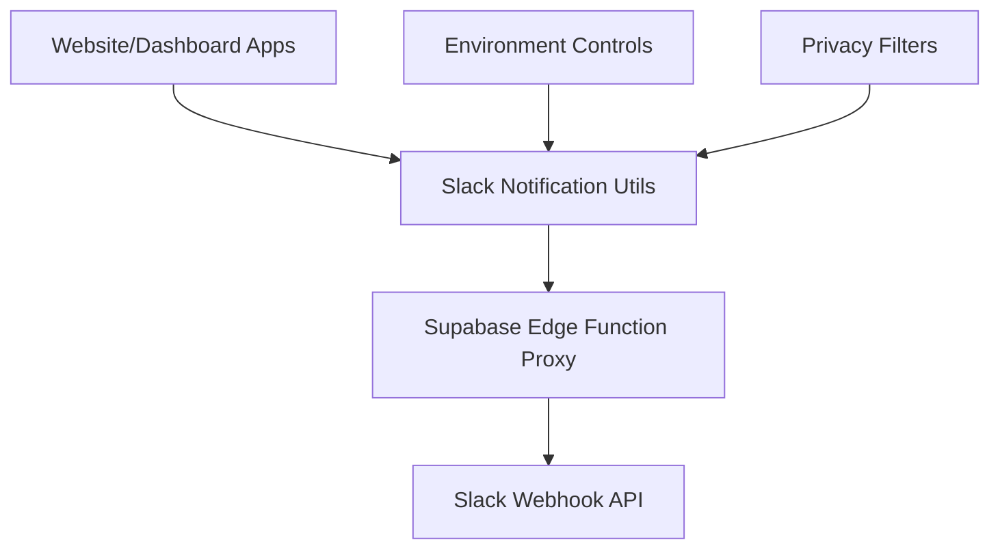

# KStoryBridge Slack Notifications - Comprehensive Guide

This document provides a complete overview of all Slack notification rules, patterns, and implementations across the entire KStoryBridge monorepo codebase.

## Table of Contents
- [Overview](#overview)
- [Architecture](#architecture)
- [Notification Types](#notification-types)
- [Implementation Patterns](#implementation-patterns)
- [Configuration](#configuration)
- [Code Locations](#code-locations)
- [Testing](#testing)
- [Troubleshooting](#troubleshooting)
- [Future Considerations](#future-considerations)

## Overview

The KStoryBridge platform implements a comprehensive Slack notification system to monitor user activities, system events, and critical failures. All notifications are processed through a centralized Supabase Edge Function proxy to avoid CORS issues and maintain consistent security practices.

### Key Features
- ✅ **Real-time user activity monitoring** (signups, signins, pitch requests)
- 🚨 **Critical error alerting** with automated failure analysis
- 🔒 **Privacy protection** with email masking and data sanitization
- 🌍 **Multi-environment support** with development/production controls
- 📊 **Structured notification format** with rich context and metadata
- 🔄 **Unified proxy system** using Supabase Edge Functions

## Architecture

### System Components



### Core Infrastructure Files

1. **Supabase Edge Function Proxy**
   - Location: `apps/website/supabase/functions/slack-webhook-proxy/index.ts`
   - Purpose: Centralized proxy for all Slack webhook requests
   - Handles CORS, authentication, and message formatting

2. **Notification Utilities**
   - Website: `apps/website/src/utils/slack.ts`
   - Website Failures: `apps/website/src/utils/slackNotifications.ts`
   - Dashboard: `apps/dashboard/src/utils/slack.ts`

3. **Integration Points**
   - Website SignupForm: `apps/website/src/components/SignupForm.tsx`
   - Website SigninPage: `apps/website/src/pages/SigninPage.tsx`
   - Website AuthCallback: `apps/website/src/pages/AuthCallbackPage.tsx`

## Notification Types

### 1. User Signup Notifications

#### Successful Signups
- **Buyer Signups**: New content buyer registrations
- **Creator Signups**: New IP owner/creator registrations

#### Failed Signups
- **Email/Password Failures**: Authentication errors during signup
- **OAuth Profile Creation Failures**: Errors creating user profiles after OAuth
- **Email Validation Failures**: Personal email rejections for business accounts

### 2. User Signin Notifications

#### Successful Signins
- **Buyer Signins**: Content buyer login events
- **Creator Signins**: IP owner/creator login events
- **General User Signins**: Unified signin tracking

#### Failed Signins
- Currently not implemented (future enhancement opportunity)

### 3. Content Activity Notifications

#### Pitch Requests (Planned)
- **Pitch Document Requests**: When buyers request pitch materials
- **Premium Content Access**: When users access gated content

### 4. System Failure Notifications

#### Critical Errors
- **Database Connection Failures**: Severity: Critical
- **Authentication System Errors**: Severity: High
- **Rate Limiting Events**: Severity: Medium
- **Validation Failures**: Severity: Low

## Implementation Patterns

### 1. Notification Data Structure

All notifications follow a consistent data structure:

```typescript
interface SlackNotificationData {
  event: string;                    // Event type (e.g., "New Buyer Signup")
  userType: 'buyer' | 'creator';   // User classification
  fullName: string;                // User's full name
  email: string;                   // User's email (privacy-masked)
  company?: string;                // Optional company information
  authType?: 'email' | 'google' | 'oauth';  // Authentication method
  timestamp?: string;              // ISO timestamp
  timezone?: string;               // User's timezone
  additionalInfo?: Record<string, unknown>; // Additional context
}
```

### 2. Privacy Protection Rules

#### Email Display
Email addresses are sent in full to allow administrators to identify users accessing the system:
```typescript
email: data.email || 'Not provided'
// Example: "john@example.com" is sent as "john@example.com"
```

#### Excluded Emails and Domains
Certain email addresses and domains are excluded from notifications:

**Excluded Individual Emails:**
- `kevin@sandstoneartists.com`
- `creepyblues@gmail.com`
- `sungho101@gmail.com`

**Excluded Domains:**
- `dadble.com`
- `kstorybridge.com`

### 3. Environment Controls

#### Development Environment
```bash
# Enable notifications in development
VITE_SLACK_ENABLE_DEV=true
```

#### Production Environment
- Notifications are enabled by default
- No additional configuration required

### 4. Error Analysis System

Automatic error categorization with severity levels:

```typescript
export function analyzeSignupFailure(error: any): {
  possibleReason: string;
  suggestedAction: string;
  severity: 'low' | 'medium' | 'high' | 'critical';
}
```

**Severity Classifications:**
- **Critical**: Database failures, system-wide issues
- **High**: Authentication configuration problems
- **Medium**: Network issues, rate limiting, timeouts
- **Low**: User errors (existing email, weak password, invalid format)

## Configuration

### Environment Variables

#### Website Application
```bash
# .env.local or .env.example
VITE_SLACK_ENABLE_DEV=true/false     # Development notifications
VITE_SLACK_WEBHOOK_URL=webhook_url   # Direct webhook (legacy)
```

#### Supabase Edge Function
```bash
# Supabase function environment
SLACK_WEBHOOK_URL=your_slack_webhook_url
```

### Supabase Configuration
```typescript
const SUPABASE_URL = "https://dlrnrgcoguxlkkcitlpd.supabase.co";
const SUPABASE_ANON_KEY = "eyJhbGciOiJIUzI1NiIsInR5cCI6IkpXVCJ9...";
const proxyUrl = `${SUPABASE_URL}/functions/v1/slack-webhook-proxy`;
```

## Code Locations

### Core Files

#### Website Application
```
apps/website/src/
├── utils/
│   ├── slack.ts                    # Main notification functions
│   └── slackNotifications.ts       # Failure-specific notifications
├── components/
│   └── SignupForm.tsx              # Signup notification triggers
├── pages/
│   ├── SigninPage.tsx              # Signin notification triggers
│   └── AuthCallbackPage.tsx        # OAuth failure notifications
└── supabase/functions/
    └── slack-webhook-proxy/
        └── index.ts                # Central proxy function
```

#### Dashboard Application
```
apps/dashboard/src/
└── utils/
    └── slack.ts                    # Dashboard-specific notifications
```

### Notification Functions by Location

#### apps/website/src/utils/slack.ts
```typescript
// Core functions
export const sendSlackNotification()
export const testSlackNotification()

// Signup notifications
export const notifyBuyerSignup()
export const notifyCreatorSignup()

// Signin notifications
export const notifyUserSignin()
export const notifyBuyerSignin()
export const notifyCreatorSignin()
```

#### apps/website/src/utils/slackNotifications.ts
```typescript
// Failure-specific functions
export async function notifySignupFailure()
export function analyzeSignupFailure()
export async function getUserIpAddress()
```

#### apps/dashboard/src/utils/slack.ts
```typescript
// Dashboard-specific functions
export const sendSlackNotification()
export const testSlackNotification()
export const notifyPitchRequest()
export const notifyBuyerSignup()
export const notifyCreatorSignup()
```

### Integration Points

#### SignupForm.tsx (Website)
```typescript
// Lines where notifications are triggered:
Line 11:  import { notifyBuyerSignup, notifyCreatorSignup } from '../utils/slack';
Line 12:  import { notifySignupFailure, analyzeSignupFailure } from '../utils/slackNotifications';
Line 263: await notifySignupFailure({ /* OAuth failure */ });
Line 279: await notifyBuyerSignup({ /* OAuth success */ });
Line 326: await notifySignupFailure({ /* Creator OAuth failure */ });
Line 342: await notifyCreatorSignup({ /* Creator OAuth success */ });
Line 373: await notifyBuyerSignup({ /* Google OAuth success */ });
Line 384: await notifyCreatorSignup({ /* Google OAuth success */ });
Line 478: await notifySignupFailure({ /* Email signup failure */ });
Line 496: await notifyBuyerSignup({ /* Email signup failure */ });
Line 507: await notifyCreatorSignup({ /* Email signup failure */ });
Line 597: await notifyBuyerSignup({ /* Email signup success */ });
Line 609: await notifyCreatorSignup({ /* Email signup success */ });
```

#### SigninPage.tsx (Website)
```typescript
Line 13: import { notifyBuyerSignin, notifyCreatorSignin, notifyUserSignin } from '../utils/slack';
// Note: Currently imported but not actively used in signin flows
```

## Testing

### Development Testing

#### 1. Enable Development Notifications
```bash
# In apps/website/.env.local
VITE_SLACK_ENABLE_DEV=true
```

#### 2. Browser Console Testing
```javascript
// Test notification from browser console
window.testSlackNotification();
```

#### 3. Manual Testing Scenarios

**Signup Failures:**
- Try signing up with existing email
- Use personal email for buyer account (Gmail, Yahoo, etc.)
- Attempt signup with weak password
- Test network connectivity issues

**Signup Successes:**
- Complete buyer signup with business email
- Complete creator signup with personal email
- Test Google OAuth signup flow

### Production Monitoring

Monitor these metrics in production:
- Notification delivery success rate
- Error categorization accuracy
- Response time for critical notifications
- Pattern identification for recurring issues

## Troubleshooting

### Common Issues

#### 1. Notifications Not Appearing
```bash
# Check environment variables
echo $VITE_SLACK_ENABLE_DEV

# Restart development server
npm run dev
```

#### 2. Proxy Function Errors
```typescript
// Check Supabase Edge Function status
const response = await fetch(proxyUrl, { /* ... */ });
console.log('Proxy status:', response.status);
console.log('Proxy response:', await response.text());
```

#### 3. Missing Notifications for Specific Events
- Verify integration point coverage
- Check console for error messages
- Ensure try/catch blocks don't suppress errors

### Debug Mode

Enable detailed logging temporarily:
```typescript
console.log('🔍 Debug: Notification data:', notificationData);
console.log('🔍 Debug: Proxy response:', response.status);
```

### Slack Webhook Verification

Test webhook directly:
```bash
curl -X POST -H 'Content-type: application/json' \
  --data '{"text":"Test message"}' \
  YOUR_SLACK_WEBHOOK_URL
```

## Message Formatting

### Slack Message Structure

Messages are formatted with emojis and structured information:

```
🎉 *New Buyer Signup*
🛒 *Type:* Content Buyer
👤 *Name:* John Smith
📧 *Email:* john@company.com
🏢 *Company:* Example Corp
• *Role:* Content Manager
• *Linkedin Url:* https://linkedin.com/in/johnsmith
• *Auth Type:* google
• *Success:* true
• *Tier:* basic

⏰ *Time:* 8/21/2024, 10:30 AM
```

### Event Emojis

```typescript
const eventEmojiMap = {
  'New Buyer Signup': '🎉',
  'New Creator Signup': '🌟',
  'User Login': '🔑',
  'Profile Updated': '✏️',
  'Title Added': '📚',
  'Contact Request': '📞',
  'Pitch Document Requested': '📄',
  'Signup Failure': '🚨',
  // Default fallback: '📢'
};
```

## Future Considerations

### Planned Enhancements

1. **Signin Failure Notifications**
   - Track failed login attempts
   - Monitor suspicious activity patterns

2. **Pitch Request Notifications**
   - Alert on premium content access
   - Track buyer engagement with content

3. **Advanced Error Analytics**
   - Rate limiting for spam prevention
   - Notification batching for similar events
   - Multi-channel support for different error types

4. **Performance Monitoring**
   - System health notifications
   - Database performance alerts
   - API response time monitoring

### Potential Integrations

1. **Monitoring Systems**
   - Connect to APM tools (Sentry, DataDog)
   - Integrate with business intelligence systems

2. **User Support**
   - Automatic ticket creation for critical failures
   - Customer success team notifications

3. **Marketing Analytics**
   - User acquisition tracking
   - Conversion funnel analysis

## Security & Privacy Guidelines

### Data Protection Rules

1. **Display full email addresses** for admin visibility
2. **Never include passwords** or sensitive tokens
3. **Limit user agent strings** to prevent data leakage
4. **Use environment controls** for development testing
5. **Implement try/catch blocks** to prevent notification failures from affecting user experience

### Access Controls

1. **Supabase RLS policies** protect the proxy function
2. **Environment-based enabling** prevents accidental notifications
3. **Webhook URL security** through Supabase environment variables

---

## Summary

The KStoryBridge Slack notification system provides comprehensive monitoring of user activities and system health across the platform. With 13+ notification types, robust privacy protection, and automated failure analysis, it enables proactive issue resolution and user experience optimization.

**Key Statistics:**
- **Files involved**: 8 main files across website and dashboard apps
- **Notification types**: 13+ distinct event types
- **Integration points**: 15+ trigger locations in signup/signin flows
- **Privacy controls**: Domain filtering, excluded addresses (full email visibility for admins)
- **Environment support**: Development/production configuration
- **Error analysis**: 8+ automated failure categorization patterns

This system forms a critical component of the platform's operational monitoring and user experience optimization strategy.