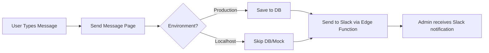

# Send Message Feature - Setup Guide

## Overview
The Send Message feature allows users to send feedback to admins via Slack and stores messages in the database. For it to work properly, you need to:

1. Create the database table
2. Deploy/configure the Slack Edge Function
3. Set up the Slack webhook

## Quick Setup Steps

### Step 1: Create Database Table

Run this SQL in your Supabase Dashboard (SQL Editor):

```sql
-- Create feedback_buyer table for user feedback messages
CREATE TABLE IF NOT EXISTS public.feedback_buyer (
    id UUID DEFAULT gen_random_uuid() PRIMARY KEY,
    user_id UUID REFERENCES auth.users(id) ON DELETE CASCADE,
    text TEXT NOT NULL,
    created_at TIMESTAMP WITH TIME ZONE DEFAULT NOW() NOT NULL,
    updated_at TIMESTAMP WITH TIME ZONE DEFAULT NOW() NOT NULL
);

-- Create indexes
CREATE INDEX IF NOT EXISTS idx_feedback_buyer_user_id ON public.feedback_buyer(user_id);
CREATE INDEX IF NOT EXISTS idx_feedback_buyer_created_at ON public.feedback_buyer(created_at DESC);

-- Enable RLS
ALTER TABLE public.feedback_buyer ENABLE ROW LEVEL SECURITY;

-- Policies
CREATE POLICY "Users can insert their own feedback"
ON public.feedback_buyer FOR INSERT
WITH CHECK (auth.uid() = user_id OR user_id IS NULL);

CREATE POLICY "Users can view their own feedback"
ON public.feedback_buyer FOR SELECT
USING (auth.uid() = user_id OR user_id IS NULL);

-- Permissions
GRANT SELECT, INSERT ON public.feedback_buyer TO anon;
GRANT SELECT, INSERT ON public.feedback_buyer TO authenticated;
```

### Step 2: Check Edge Function Status

The Slack Edge Function proxy already exists at:
`apps/website/supabase/functions/slack-webhook-proxy/index.ts`

To deploy it to Supabase:

```bash
# From apps/website directory
cd apps/website

# Link to your Supabase project (if not already linked)
supabase link --project-ref dlrnrgcoguxlkkcitlpd

# Deploy the function
supabase functions deploy slack-webhook-proxy

# Set the Slack webhook URL secret
supabase secrets set SLACK_WEBHOOK_URL=your_actual_slack_webhook_url
```

### Step 3: Get Slack Webhook URL

1. Go to your Slack workspace
2. Navigate to: Apps → Incoming Webhooks
3. Add a new webhook or use existing one
4. Copy the webhook URL (starts with `https://hooks.slack.com/services/...`)
5. Set it in Supabase secrets (see Step 2)

## Testing the Feature

### Option A: Test with Real Authentication (Recommended)

1. Make sure database table is created (Step 1)
2. Make sure Edge Function is deployed with webhook URL (Step 2)
3. Sign in to dashboard normally
4. Navigate to "Send msg" in the sidebar
5. Type a message and send

### Option B: Test Without Authentication

1. Open: http://localhost:8083/test-send-message
2. This page simulates the process but won't create real Slack/DB entries

### Option C: Test Slack Connection Directly

1. Open the file: `test-slack-direct.html` in your browser
2. Click "Test Supabase Connection" button
3. Check the console logs to see if the Edge Function is working

## Troubleshooting

### Problem: "No Slack message received"

**Cause 1**: Edge Function not deployed
- Solution: Deploy the Edge Function (Step 2)

**Cause 2**: SLACK_WEBHOOK_URL not set
- Solution: Set the webhook URL in Supabase secrets

**Cause 3**: CORS blocking direct Slack calls
- Solution: Must use Supabase Edge Function proxy, not direct calls

### Problem: "No database entry created"

**Cause**: Table doesn't exist
- Solution: Run the SQL from Step 1 in Supabase SQL Editor

### Problem: "Nothing happens when clicking Send"

**Cause**: Using mock user in localhost
- Solution: The current implementation works with mock users, check browser console for errors

## How It Works



## Files Involved

- **UI Component**: `src/pages/SendMessage.tsx`
- **Routes**: `src/App.tsx`
- **Menu**: `src/components/layout/CMSSidebar.tsx`
- **Slack Utils**: `src/utils/slack.ts`
- **Edge Function**: `apps/website/supabase/functions/slack-webhook-proxy/index.ts`
- **Database Migration**: `supabase/migrations/20250127000000-create-feedback-buyer-table.sql`

## Current Status

✅ **Completed**:
- UI component created
- Menu item added
- Routes configured
- Slack utility functions ready
- Edge Function exists (in website app)
- Database migration created

⚠️ **Needs Setup**:
- Database table creation (run SQL)
- Edge Function deployment
- Slack webhook URL configuration

## Next Steps

1. **Run the SQL** to create the database table
2. **Deploy the Edge Function** with your Slack webhook URL
3. **Test the feature** using one of the testing options above

Once these steps are complete, the Send Message feature will be fully functional!