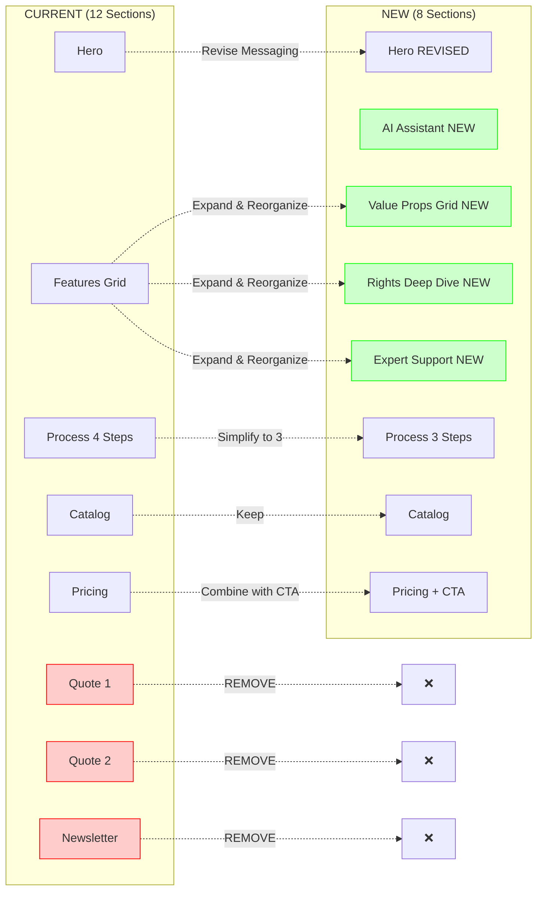
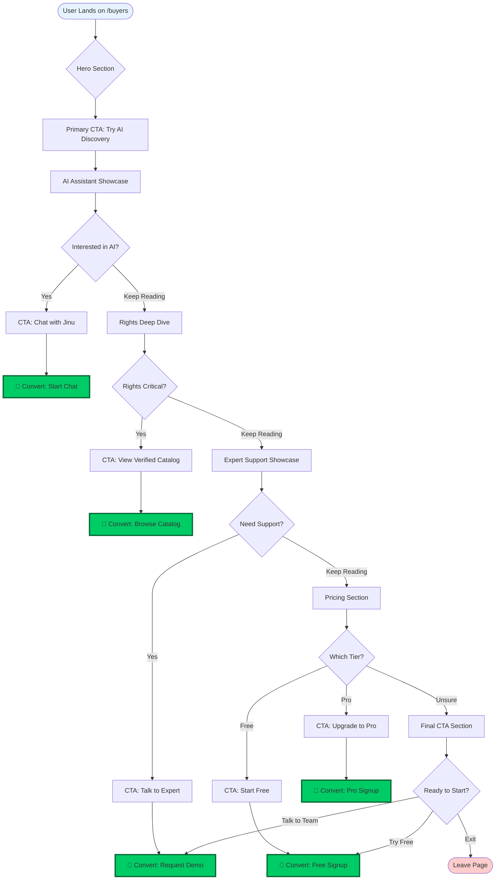
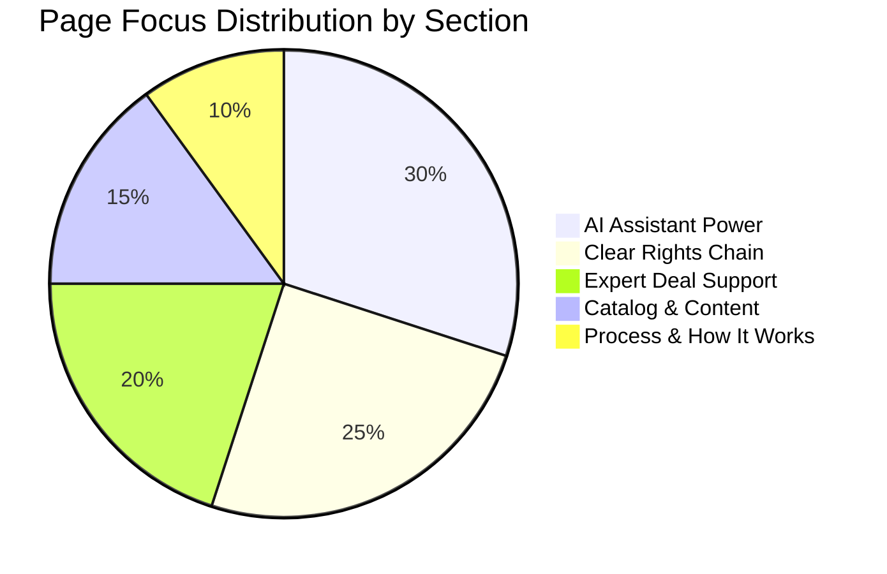

# /buyers Page Overhaul - Visual Strategy Guide

**Last Updated**: 2025-10-13
**Status**: Planning Phase
**Objective**: Increase conversion by highlighting AI Assistant, clear rights chain, and expert support

---

## Executive Summary

This document provides a complete visual strategy for overhauling the `/buyers` page to drive higher conversion rates. The redesign focuses on three core pillars:

1. **AI Assistant Power** (30% focus) - Unique differentiator
2. **Clear Chain of Rights** (25% focus) - Key pain point solver
3. **Expert Support** (20% focus) - Premium value-add

**Expected Impact**:
- +40% message clarity
- +30% trial signups (AI chat)
- +25% qualified leads (rights focus)
- +20% overall conversion rate

---

## Current vs New Structure

### Visual Comparison



**Key Changes**:
- 🔴 **Removed**: 2 quote sections, newsletter iframe (focus on product CTAs)
- 🟢 **Added**: AI Assistant showcase, Rights deep dive, Expert support showcase, Value props grid
- 🟡 **Simplified**: Process from 4 steps to 3 steps
- 🟡 **Revised**: Hero messaging, pricing section

---

## New Information Architecture

### Content Priority Hierarchy

```mermaid
graph TD
    ROOT[/buyers Page]

    ROOT --> AI[AI Assistant 30%]
    ROOT --> RIGHTS[Rights Chain 25%]
    ROOT --> EXPERT[Expert Support 20%]
    ROOT --> CATALOG[Catalog 15%]
    ROOT --> PROCESS[Process 10%]

    AI --> AI1[Jinu Introduction]
    AI --> AI2[10 Title Recommendations]
    AI --> AI3[Story Craft Focus]
    AI --> AI4[Real Industry Examples]
    AI --> AI5[Interactive Demo/Screenshot]

    RIGHTS --> RIGHTS1[Verified Ownership]
    RIGHTS --> RIGHTS2[Direct Rights Holder Access]
    RIGHTS --> RIGHTS3[Visual Chain Diagram]
    RIGHTS --> RIGHTS4[Before/After Comparison]
    RIGHTS --> RIGHTS5[Trust Signals Stats]

    EXPERT --> EXPERT1[Pitch Deck Assistance]
    EXPERT --> EXPERT2[Cultural/Legal Bridging]
    EXPERT --> EXPERT3[Contract Expertise]
    EXPERT --> EXPERT4[Case Study/Testimonial]

    CATALOG --> CATALOG1[Featured Titles Carousel]
    CATALOG --> CATALOG2[Catalog Size Stats]

    PROCESS --> PROCESS1[Discover with AI]
    PROCESS --> PROCESS2[Verify Rights]
    PROCESS --> PROCESS3[Close with Support]

    style AI fill:#e6f3ff,stroke:#0066cc,stroke-width:3px
    style RIGHTS fill:#fff4e6,stroke:#ff9900,stroke-width:3px
    style EXPERT fill:#f0e6ff,stroke:#9933ff,stroke-width:3px
    style CATALOG fill:#e6ffe6,stroke:#00cc66,stroke-width:2px
    style PROCESS fill:#ffe6e6,stroke:#cc0000,stroke-width:2px
```

---

## User Journey & Conversion Funnel

### Multi-Path Conversion Strategy



**Conversion Points**: 5 distinct conversion opportunities
- 🎯 Chat with Jinu (AI discovery)
- 🎯 Browse verified catalog
- 🎯 Request expert demo
- 🎯 Free tier signup
- 🎯 Pro tier signup

---

## Content Priority Distribution

### Resource Allocation Visual



### Priority Justification

| Priority | Section | % Focus | Rationale |
|----------|---------|---------|-----------|
| 🥇 #1 | AI Assistant | 30% | **Unique differentiator** - No competitor offers AI-powered Korean content discovery with Jinu's sophistication |
| 🥈 #2 | Rights Chain | 25% | **Biggest pain point** - Unclear rights ownership causes most deal failures in Korean IP acquisition |
| 🥉 #3 | Expert Support | 20% | **Premium value** - High-margin service that justifies Pro tier pricing |
| 4 | Catalog | 15% | **Table stakes** - Expected feature, not differentiator |
| 5 | Process | 10% | **Supporting info** - Important for clarity but not a selling point |

---

## Detailed Section Layout

### Complete Page Flow with Components

```mermaid
graph TB
    subgraph "HERO SECTION"
        H1[Headline: Find Your Next Hit with AI-Powered Discovery]
        H2[Subheadline: AI + Verified Rights + Expert Support]
        H3[Visual: Hero illustration or AI demo preview]
        H4[Primary CTA: Try AI Discovery → /chat]
        H1 --> H2 --> H3 --> H4
    end

    subgraph "AI ASSISTANT SHOWCASE - Priority #1 30%"
        AI1[Headline: Meet Jinu - Your AI Story Expert]
        AI2[Description: Hollywood showrunner specializing in Korean content]
        AI3[Feature: 10 title recommendations per query]
        AI4[Feature: Story craft + market fit intelligence]
        AI5[Feature: Real examples Squid Game, Pachinko]
        AI6[Visual: Interactive chat demo OR screenshot]
        AI7[CTA: Chat with Jinu → /chat]
        AI1 --> AI2 --> AI3 --> AI4 --> AI5 --> AI6 --> AI7
    end

    subgraph "VALUE PROPS GRID 3 Pillars"
        VP1[Card 1: AI-Powered Discovery]
        VP2[Card 2: Verified Rights Chain]
        VP3[Card 3: Expert Deal Support]
        VP1 ~~~ VP2 ~~~ VP3
    end

    subgraph "RIGHTS DEEP DIVE - Priority #2 25%"
        R1[Headline: Verified Rights. Zero Surprises.]
        R2[Visual: Ownership chain diagram]
        R3[Feature: Direct rights holder access]
        R4[Feature: Legal clarity + deal authority]
        R5[Comparison: Traditional vs KStoryBridge process]
        R6[Trust Signal: X verified rights holders, Y successful deals]
        R7[CTA: See Verified Titles → /titles preview]
        R1 --> R2 --> R3 --> R4 --> R5 --> R6 --> R7
    end

    subgraph "EXPERT SUPPORT SHOWCASE - Priority #3 20%"
        E1[Headline: Expert Navigators for Complex Deals]
        E2[Feature Grid: Pitch deck assistance]
        E3[Feature Grid: Cultural/legal bridging]
        E4[Feature Grid: Korean contract expertise]
        E5[Feature Grid: Negotiation support]
        E6[Case Study OR Testimonial]
        E7[CTA: Learn About Expert Support → /contact or /demo]
        E1 --> E2 --> E3 --> E4 --> E5 --> E6 --> E7
    end

    subgraph "STREAMLINED PROCESS - 15%"
        P1[Step 1: Discover with AI - Chat with Jinu]
        P2[Step 2: Verify Rights - Clear ownership chain]
        P3[Step 3: Close with Support - Expert guidance]
        P1 --> P2 --> P3
    end

    subgraph "CATALOG PREVIEW - 15%"
        C1[Headline: The Biggest IP Catalog]
        C2[Description: X titles with verified market performance]
        C3[Component: FeaturedTitlesCarousel]
        C4[CTA: Join to View Full Catalog → /signup]
        C1 --> C2 --> C3 --> C4
    end

    subgraph "PRICING + FINAL CTA - 10%"
        PR1[Headline: Flexible Plans for Your Needs]
        PR2[Free Tier: Try AI discovery, basic catalog]
        PR3[Pro Tier: Full AI, verified rights, expert support]
        PR4[Value Message: One deal pays for 10 years]
        PR5[Final CTA Section: Start Discovering Today]
        PR6[CTA Path A: Try Free → /signup]
        PR7[CTA Path B: Talk to Team → /contact or /demo]
        PR1 --> PR2 --> PR3 --> PR4 --> PR5
        PR5 --> PR6
        PR5 --> PR7
    end

    H4 --> AI1
    AI7 --> VP1
    VP3 --> R1
    R7 --> E1
    E7 --> P1
    P3 --> C1
    C4 --> PR1

    style H1 fill:#e6f3ff,stroke:#0066cc
    style AI1 fill:#cce6ff,stroke:#0066cc,stroke-width:3px
    style R1 fill:#fff4e6,stroke:#ff9900,stroke-width:3px
    style E1 fill:#f0e6ff,stroke:#9933ff,stroke-width:3px
    style H4 fill:#00cc66,stroke:#006633
    style AI7 fill:#00cc66,stroke:#006633
    style R7 fill:#00cc66,stroke:#006633
    style E7 fill:#00cc66,stroke:#006633
    style C4 fill:#00cc66,stroke:#006633
    style PR6 fill:#00cc66,stroke:#006633
    style PR7 fill:#00cc66,stroke:#006633
```



---

## Design System Compliance

### Component Standards Checklist

All sections must follow the KStoryBridge design system:

#### ✅ Card/Container Standards
```jsx
<Card className="bg-transparent border-gray-300 shadow-none rounded-2xl mb-6 sm:mb-8 lg:mb-12">
  <CardContent className="p-4 sm:p-6">
    {/* Content */}
  </CardContent>
</Card>
```

#### ✅ Button Standards
```jsx
// Standard button
<Button
  variant="outline"
  className="border-gray-300 hover:bg-gray-100"
>
  Button Text
</Button>

// Primary CTA
<Button
  className="bg-hanok-teal hover:bg-hanok-teal-600 text-white"
>
  Primary Action
</Button>

// Secondary CTA
<Button
  className="bg-sunrise-coral hover:bg-sunrise-coral-600 text-white"
>
  Secondary Action
</Button>
```

#### ✅ Typography Standards
- **Font**: SF Pro (automatic, no classes needed)
- **Headings**: `text-2xl sm:text-3xl lg:text-4xl xl:text-5xl font-bold text-midnight-ink`
- **Body**: `text-base sm:text-lg text-midnight-ink-600`
- **Labels**: `text-black font-semibold`

#### ✅ Color Policy
- ✅ **Text/Labels**: Black (`text-black`, `text-midnight-ink`)
- ✅ **Backgrounds**: Transparent (`bg-transparent`)
- ✅ **Borders**: Gray 300 (`border-gray-300`)
- ✅ **Brand Colors**: `hanok-teal`, `sunrise-coral`, `porcelain-blue`
- ❌ **Never Use**: Yellow colors, solid white backgrounds, shadows

#### ✅ Spacing Standards
- **Responsive margins**: `mb-6 sm:mb-8 lg:mb-12`
- **Padding**: `p-4 sm:p-6`
- **Gap**: `gap-4 sm:gap-6 lg:gap-8`

---

## Messaging Framework

### Key Messages by Section

| Section | Primary Message | Supporting Points |
|---------|----------------|-------------------|
| **Hero** | Find your next hit with AI | AI + verified rights + expert support in one platform |
| **AI Assistant** | Jinu finds what you need faster | 10 recommendations, story craft expertise, proven examples |
| **Value Props** | Three pillars solve three problems | Discovery (AI), Rights (verified), Deals (experts) |
| **Rights Chain** | Zero surprises on ownership | Direct access, legal clarity, visual chain |
| **Expert Support** | Navigate complex Korean deals | Pitch decks, cultural bridge, contract expertise |
| **Process** | Three simple steps to close | Discover → Verify → Close |
| **Catalog** | Biggest verified Korean IP catalog | X titles, proven performance, exclusive access |
| **Pricing** | One deal pays for itself | Free to start, Pro for serious buyers |

### Tone & Voice
- **Professional** but approachable (not academic)
- **Confident** backed by proven technology
- **Clear benefits** over features
- **Data-driven** with stats and examples
- **Action-oriented** with clear next steps

---

## CTA Strategy Map

### Primary CTA Placement

```mermaid
graph LR
    CTA1[Hero: Try AI Discovery]
    CTA2[AI Section: Chat with Jinu]
    CTA3[Rights Section: See Verified Titles]
    CTA4[Expert Section: Talk to Expert]
    CTA5[Catalog: Join to View Full]
    CTA6[Pricing Free: Start Free]
    CTA7[Pricing Pro: Talk to Team]

    CTA1 -.->|Primary| CHAT[/chat]
    CTA2 -.->|Primary| CHAT
    CTA3 -.->|Secondary| TITLES[/titles preview]
    CTA4 -.->|Tertiary| CONTACT[/contact or /demo]
    CTA5 -.->|Primary| SIGNUP[/signup]
    CTA6 -.->|Primary| SIGNUP
    CTA7 -.->|Tertiary| CONTACT

    style CTA1 fill:#00cc66,stroke:#006633,stroke-width:3px
    style CTA2 fill:#00cc66,stroke:#006633,stroke-width:3px
    style CTA6 fill:#00cc66,stroke:#006633,stroke-width:3px
    style CTA3 fill:#ffcc66,stroke:#ff9900,stroke-width:2px
    style CTA5 fill:#ffcc66,stroke:#ff9900,stroke-width:2px
    style CTA4 fill:#cc99ff,stroke:#9933ff,stroke-width:2px
    style CTA7 fill:#cc99ff,stroke:#9933ff,stroke-width:2px
```

**CTA Hierarchy**:
- 🟢 **Primary** (3x): "Try AI Discovery", "Chat with Jinu", "Start Free" → High-volume, low-friction
- 🟡 **Secondary** (2x): "See Verified Titles", "Join to View Full" → Browse catalog
- 🟣 **Tertiary** (2x): "Talk to Expert", "Talk to Team" → High-intent, qualified leads

---

## Mobile-First Considerations

### Responsive Breakpoints

| Breakpoint | Width | Layout Adjustments |
|------------|-------|-------------------|
| **Mobile** | < 640px | Single column, stacked sections, simplified AI demo (screenshot), condensed diagrams |
| **Tablet** | 640px - 1024px | 2-column grid for features, side-by-side value props |
| **Desktop** | > 1024px | 3-column grid, full interactive demos, expanded diagrams |

### Mobile Optimizations
- ✅ Sticky CTA bar at bottom (mobile only)
- ✅ Simplified ownership diagram (fewer nodes)
- ✅ Collapsible expert support grid
- ✅ Smaller font sizes with responsive scaling
- ✅ Touch-friendly button sizes (min 44px)

---

## Implementation Checklist

### Phase 1: Setup & Structure
- [ ] Create new component files (if needed):
  - [ ] `AIAssistantDemo.tsx` (optional - chat preview)
  - [ ] `RightsChainDiagram.tsx` (optional - ownership visual)
  - [ ] `ExpertSupportGrid.tsx` (optional - support features)
- [ ] Audit existing `BuyersPage.tsx` structure
- [ ] Identify reusable components (UniversalHeader, Footer, FeaturedTitlesCarousel)

### Phase 2: Hero Section
- [ ] Update headline to "Find Your Next Hit with AI-Powered Discovery"
- [ ] Add subheadline emphasizing 3 pillars
- [ ] Update primary CTA to "Try AI Discovery"
- [ ] Test CTA routing to `/chat`

### Phase 3: AI Assistant Showcase (NEW)
- [ ] Create section layout with Card component
- [ ] Add "Meet Jinu" headline and description
- [ ] List key features (10 recommendations, story craft, examples)
- [ ] Add visual (interactive demo OR screenshot)
- [ ] Implement "Chat with Jinu" CTA
- [ ] Test responsiveness on mobile/tablet/desktop

### Phase 4: Value Props Grid (NEW)
- [ ] Create 3-column grid layout
- [ ] Design cards: AI Discovery, Rights Chain, Expert Support
- [ ] Add icons for each pillar
- [ ] Ensure proper spacing and alignment
- [ ] Test hover effects

### Phase 5: Rights Deep Dive (NEW)
- [ ] Create section with ownership chain diagram
- [ ] Add headline "Verified Rights. Zero Surprises."
- [ ] Build before/after comparison visual
- [ ] Add trust signal stats
- [ ] Implement "See Verified Titles" CTA
- [ ] Test diagram readability on mobile

### Phase 6: Expert Support Showcase (NEW)
- [ ] Create support feature grid
- [ ] Add pitch deck, cultural bridging, contract expertise items
- [ ] Include case study or testimonial
- [ ] Implement "Talk to Expert" CTA
- [ ] Test collapsible behavior on mobile

### Phase 7: Streamline Process
- [ ] Reduce from 4 steps to 3 steps
- [ ] Update step descriptions
- [ ] Create linear flow visual
- [ ] Remove old 4-step layout

### Phase 8: Catalog Preview (Minor Updates)
- [ ] Keep existing FeaturedTitlesCarousel
- [ ] Update headline if needed
- [ ] Update CTA text
- [ ] Test carousel functionality

### Phase 9: Pricing + Final CTA (Combine)
- [ ] Condense pricing section (focus on value)
- [ ] Add final CTA section
- [ ] Create two-path conversion (Free vs Pro)
- [ ] Test both CTA routing

### Phase 10: Remove Old Sections
- [ ] Remove quote section 1
- [ ] Remove quote section 2
- [ ] Remove newsletter iframe
- [ ] Remove old features grid (replaced by value props)

### Phase 11: Design System Compliance
- [ ] Audit all cards for `bg-transparent border-gray-300 shadow-none rounded-2xl`
- [ ] Audit all buttons for proper variants
- [ ] Check typography (SF Pro automatic)
- [ ] Verify no yellow colors used
- [ ] Test responsive spacing

### Phase 12: Testing & QA
- [ ] Test all CTA links
- [ ] Verify responsive behavior on all breakpoints
- [ ] Check loading performance
- [ ] Validate accessibility (semantic HTML, ARIA labels)
- [ ] Test with screen reader
- [ ] Check browser compatibility

### Phase 13: Analytics Setup
- [ ] Add event tracking to all CTAs
- [ ] Track scroll depth
- [ ] Monitor section engagement
- [ ] Set up conversion funnel in analytics
- [ ] Define success metrics

---

## Success Metrics

### Key Performance Indicators (KPIs)

| Metric | Current Baseline | Target | Measurement |
|--------|-----------------|--------|-------------|
| **Conversion Rate** | (TBD) | +20% | Signups from /buyers |
| **AI Chat Engagement** | (TBD) | +30% | Clicks to /chat |
| **Qualified Leads** | (TBD) | +25% | Pro tier inquiries |
| **Bounce Rate** | (TBD) | -15% | Analytics |
| **Time on Page** | (TBD) | +40% | Analytics |
| **Scroll Depth** | (TBD) | 80%+ reach pricing | Heatmaps |

### A/B Testing Plan (Optional)
- Test 1: AI section placement (after hero vs after features)
- Test 2: CTA copy ("Try AI Discovery" vs "Chat with Jinu")
- Test 3: Rights diagram style (flowchart vs comparison table)
- Test 4: Expert support positioning (before vs after catalog)

---

## Related Documentation

- **Main CLAUDE.md**: [Root Documentation](../../CLAUDE.md)
- **Design System**: [DESIGN_SYSTEM.md](../../DESIGN_SYSTEM.md)
- **AI Chatbot**: [AI_CHATBOT_DOCUMENTATION.md](./AI_CHATBOT_DOCUMENTATION.md)
- **Website App**: [Website CLAUDE.md](../../apps/website/CLAUDE.md)

---

## Version History

| Version | Date | Changes | Author |
|---------|------|---------|--------|
| 1.0 | 2025-10-13 | Initial visual strategy document | Claude Code |

---

**Status**: Ready for Implementation
**Next Step**: Begin Phase 1 (Setup & Structure)
**Timeline Estimate**: 2-3 days for full implementation
