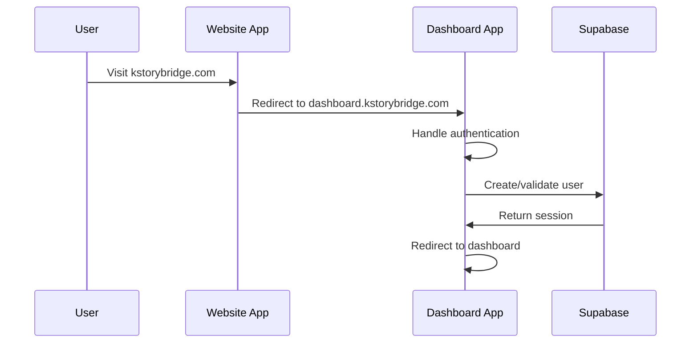
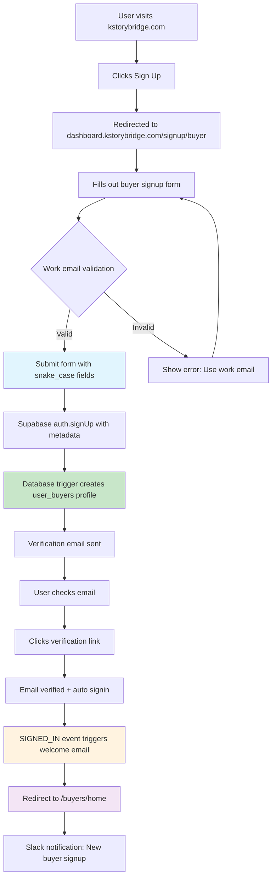
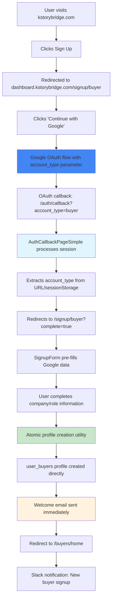
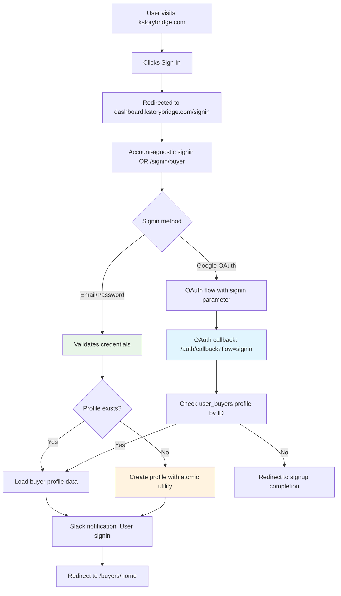
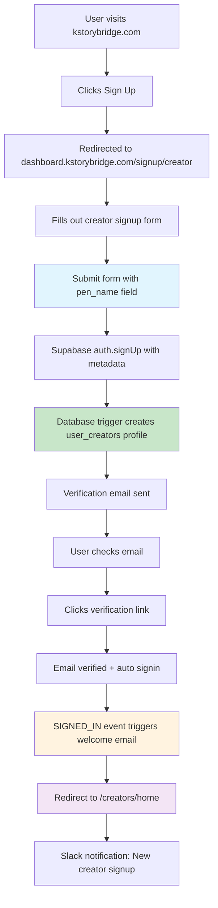
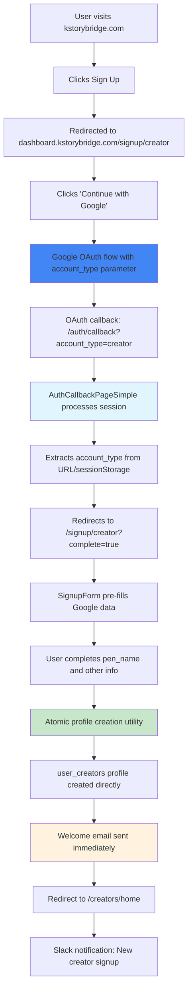
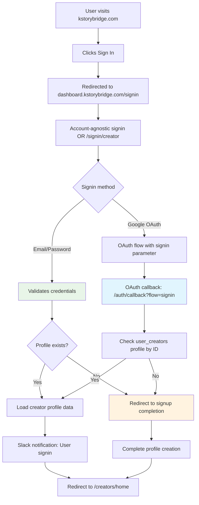

# KStoryBridge Dashboard - User Journey Map

**Last Updated:** 2025-01-19
**Version:** 1.0
**Coverage:** Complete user flows for Buyer and Creator accounts

This document provides a comprehensive map of all user journeys through the KStoryBridge Dashboard system, including authentication flows, account creation, and key user interactions.

## Table of Contents

1. [System Architecture Overview](#system-architecture-overview)
2. [User Types & Account Flow](#user-types--account-flow)
3. [Detailed Journey Maps](#detailed-journey-maps)
4. [Critical System Processes](#critical-system-processes)
5. [Failure Points & Recovery](#failure-points--recovery)
6. [External System Integration](#external-system-integration)
7. [Performance Considerations](#performance-considerations)

---

## System Architecture Overview

### Split-App Architecture

**Website App (`kstorybridge.com`)**
- Marketing pages and content discovery
- Redirects to Dashboard for ALL authentication
- No user accounts or authentication logic

**Dashboard App (`dashboard.kstorybridge.com`)**
- Complete authentication system (signin/signup/OAuth)
- User dashboards for both account types
- Protected content and features
- Cross-domain session management

**Shared Backend**
- Single Supabase instance (`dlrnrgcoguxlkkcitlpd`)
- Segregated data by account type
- Shared authentication system
- Centralized email and notification services

### Account Types

#### Buyers
- **Purpose**: Media buyers, producers, executives seeking Korean content
- **Email Requirement**: Work emails only (personal domains blocked)
- **Default Tier**: `basic` (changed from `invited` on 2025-08-21)
- **Dashboard**: `/buyers/home`
- **Database Table**: `user_buyers`

#### Creators (formerly IP Owners)
- **Purpose**: Content creators, authors, agents sharing their work
- **Email Requirement**: Any email allowed
- **Default Status**: `invited` (requires approval)
- **Dashboard**: `/creators/home`
- **Database Table**: `user_creators`

---

## User Types & Account Flow

### Authentication Methods

1. **Email/Password**: Standard form-based with email verification
2. **OAuth (Google)**: One-click signup/signin with profile completion

### Cross-Domain Flow



---

## Detailed Journey Maps

### 🔵 Buyer Journey - Email Signup



**Key Technical Details:**
- **Form Fields**: `full_name`, `buyer_company`, `buyer_role`, `linkedin_url` (all snake_case)
- **Validation**: Work email domains only (blocks gmail.com, yahoo.com, etc.)
- **Metadata Storage**: All form data stored in auth.user_metadata
- **Profile Creation**: Database trigger creates `user_buyers` record from metadata
- **Default Values**: `tier: 'basic'`, `requested: false`

### 🔵 Buyer Journey - OAuth Signup



**Key Technical Details:**
- **OAuth URL**: Includes `account_type=buyer` parameter
- **Session Storage**: Fallback storage for account type
- **Form Pre-fill**: Google profile data auto-populates name/email
- **Atomic Creation**: `createBuyerProfileAtomic()` with retry logic
- **No Email Verification**: OAuth users are pre-verified

### 🔵 Buyer Journey - Signin



**Key Technical Details:**
- **Profile Check**: Queries `user_buyers` by user.id (not email due to RLS)
- **Missing Profile**: Creates profile using atomic utility if missing
- **Account Type**: Uses existing auth.user_metadata.account_type
- **Fallback Detection**: Multiple methods if account_type missing

### 🟠 Creator Journey - Email Signup



**Key Technical Details:**
- **Required Fields**: `full_name`, `pen_name` (always use pen_name, not penNameOrStudio)
- **Optional Fields**: `ip_owner_role`, `ip_owner_company`, `website_url`
- **Default Status**: `invitation_status: 'invited'`
- **Profile Creation**: Database trigger from auth metadata

### 🟠 Creator Journey - OAuth Signup



**Key Technical Details:**
- **OAuth URL**: Includes `account_type=creator` parameter
- **Atomic Creation**: `createCreatorProfileAtomic()` with retry logic
- **Required Completion**: pen_name must be provided by user
- **Immediate Email**: Welcome email sent without verification delay

### 🟠 Creator Journey - Signin



**Key Technical Details:**
- **Profile Check**: Queries `user_creators` by user.id
- **Missing Profile**: Redirects to signup completion (no auto-creation)
- **Account Type**: Uses existing auth.user_metadata.account_type

---

## Critical System Processes

### 1. Authentication State Management (`useAuth.tsx`)

```typescript
// Session Lifecycle Flow:
1. URL Parameters Check → Extract OAuth tokens if present
2. Session Validation → Health checks and token refresh
3. Welcome Email Logic → SIGNED_IN event handling
4. Token Refresh → Automatic renewal before expiry
5. Cross-domain Session → Token transfer from website
6. Health Monitoring → 5-minute interval checks
```

**Key Features:**
- **Robust Recovery**: Multi-layer timeout and session recovery
- **Health Checks**: Automatic validation and refresh
- **Email Integration**: Welcome email on SIGNED_IN event
- **Cross-Domain**: Secure token transfer between apps

### 2. Account Type Detection Pipeline (`accountTypeDetection.ts`)

```typescript
// Priority Order (highest to lowest):
1. User Metadata → user.user_metadata.account_type (OAuth flows)
2. Database Lookup → Check user_buyers/user_creators tables
3. URL Parameters → account_type param (signup flows)
4. SessionStorage → oauth_account_type fallback
5. Default to 'buyer' → Backward compatibility
```

**Implementation Details:**
- **Cache Results**: Avoid repeated expensive operations
- **RLS Handling**: Graceful degradation when database queries fail
- **Confidence Scoring**: Track detection reliability
- **Debug Logging**: Comprehensive logging for troubleshooting

### 3. Profile Creation Mechanisms

#### Database Trigger Method (Email Signups)
```sql
-- Trigger: on_auth_user_profile_routing
-- Creates profile automatically from auth.user_metadata
-- Handles both buyer and creator account types
-- Includes all required fields with defaults
```

#### Atomic Creation Method (OAuth Signups)
```typescript
// createBuyerProfileAtomic() / createCreatorProfileAtomic()
// Features:
- Retry logic (3 attempts with exponential backoff)
- Conflict resolution (handle existing profiles)
- Field validation (ensure all required fields)
- Error reporting (detailed failure information)
```

### 4. Email System Architecture (`EmailService`)

```typescript
// Centralized Email Management:
1. Duplicate Prevention → Check email_logs table
2. Template Selection → Account type-specific content
3. Edge Function → Send via Supabase + Resend
4. Logging → Track all attempts (success/failure)
5. Error Handling → Graceful degradation on failures
```

**Key Features:**
- **Singleton Pattern**: Single EmailService instance
- **Database Tracking**: Prevent duplicate emails
- **Template Engine**: Dynamic content based on account type
- **Non-blocking**: Email failures don't break user flows

### 5. OAuth Callback Processing (`AuthCallbackPageSimple`)

```typescript
// Callback Processing Flow:
1. Code Exchange → OAuth code for session tokens
2. Account Type Resolution → URL → storage → metadata chain
3. Flow Detection → signin vs signup determination
4. Profile Checking → Existence validation (with RLS fallbacks)
5. Redirection → Appropriate dashboard or completion page
```

**Critical Features:**
- **Timeout Handling**: 20-second maximum processing time
- **Fallback Detection**: Multiple methods for account type
- **RLS Bypass**: Workarounds for permission issues
- **Error Recovery**: Graceful handling of various failure modes

---

## Failure Points & Recovery

### Critical Failure Scenarios

#### 1. OAuth Callback RLS Issues
**Problem**: Row Level Security blocks profile existence checks
**Impact**: Users stuck in infinite loading or redirect loops
**Recovery**:
- Fallback to alternative profile check methods
- Bypass problematic queries for known users
- Timeout and redirect to dashboard for verification

#### 2. Session Corruption
**Problem**: Invalid or corrupted tokens in localStorage
**Impact**: Infinite loading states, authentication failures
**Recovery**:
- Automatic session health checks
- Token refresh attempts
- Complete session cleanup and re-authentication

#### 3. Account Type Detection Failure
**Problem**: Missing or corrupted account_type metadata
**Impact**: Users redirected to wrong dashboard or signin
**Recovery**:
- Multiple detection methods with priority fallback
- Database lookup as secondary verification
- Default to buyer for backward compatibility

#### 4. Email Duplication
**Problem**: Multiple triggers sending welcome emails
**Impact**: Poor user experience, confusion
**Recovery**:
- Database-backed deduplication via email_logs
- Centralized EmailService with duplicate checking
- Removal of localStorage-based tracking

#### 5. Database Connectivity Issues
**Problem**: Network issues preventing profile creation/lookup
**Impact**: Users unable to complete signup or signin
**Recovery**:
- Retry mechanisms with exponential backoff
- Timeout handling with user feedback
- Graceful degradation to essential functionality

### Recovery Mechanisms

#### Session Health System
```typescript
// Automatic Recovery Features:
- 5-minute health check intervals
- Automatic token refresh before expiry
- Corruption detection and cleanup
- Emergency timeout procedures (15 seconds)
```

#### Multi-Layer Timeouts
```typescript
// DashboardEntrypoint Timeout Strategy:
- 3 seconds: Warning timeout (log only)
- 8 seconds: Recovery timeout (attempt session recovery)
- 15 seconds: Emergency timeout (force cleanup and signout)
```

#### Atomic Operations
```typescript
// Profile Creation Reliability:
- 3 retry attempts with exponential backoff
- Conflict detection and resolution
- Comprehensive error reporting
- Fallback to manual completion flows
```

---

## External System Integration

### Slack Notification System

**Purpose**: Internal team notifications for user activities
**Blacklist Filtering**: Excludes internal email addresses and domains

```typescript
// Filtered Notifications:
EXCLUDED_EMAILS = [
  'sungho@kstorybridge.com',
  'kevin@sandstoneartists.com',
  'creepyblues@gmail.com'
];

EXCLUDED_DOMAINS = [
  'dadble.com',
  'kstorybridge.com'
];
```

**Notification Types**:
- User signups (buyer/creator)
- User signins
- Pitch document requests
- User feedback submissions

### Email Service Integration

**Provider**: Resend via Supabase Edge Function
**Templates**: Account type-specific welcome emails
**Tracking**: Complete logging in email_logs table

**Email Types**:
- Welcome emails (personalized by account type)
- Email verification reminders
- Password reset confirmations
- Tier upgrade notifications

### Session-Based Cache System

**Philosophy**: Prioritize data integrity over performance
**Lifecycle**: Tied to authentication sessions (1-hour expiry)
**Strategy**: Database-first with session reuse

**Key Features**:
- Automatic cleanup on logout/session expiry
- No cross-session persistence
- Database connectivity error handling
- Cache size monitoring and limits

---

## Performance Considerations

### Authentication Speed Targets

- **Email Signup**: < 3 seconds to verification email
- **OAuth Signup**: < 5 seconds to dashboard
- **Email Signin**: < 2 seconds to dashboard
- **OAuth Signin**: < 3 seconds to dashboard

### Optimization Strategies

#### Account Type Detection
- Cache results to avoid repeated database queries
- Use metadata as primary source (fastest)
- Implement query timeouts (5 seconds max)
- Graceful degradation on failures

#### Session Management
- Health checks at optimal intervals (5 minutes)
- Proactive token refresh before expiry
- Minimal session validation on route changes
- Efficient cross-domain token transfer

#### Database Operations
- Use email-based queries (better performance than ID)
- Implement query timeouts and retries
- Batch operations where possible
- Monitor and optimize slow queries

### Error Recovery Performance

- **Detection Time**: < 1 second for most issues
- **Recovery Attempt**: < 5 seconds
- **Emergency Fallback**: < 15 seconds total
- **User Feedback**: Immediate loading indicators

---

## User Experience Guidelines

### Loading States

**Authentication Flow**:
- Clear progress indicators during OAuth
- Informative messages during processing
- Timeout warnings and recovery status
- Emergency fallback notifications

**Error Messaging**:
- User-friendly error descriptions
- Clear action items for resolution
- Help links for common issues
- Escalation paths for persistent problems

### Cross-Domain UX

**Seamless Transitions**:
- Preserve user context during redirects
- Maintain session state across domains
- Clear loading indicators during transfers
- Consistent branding and messaging

**Mobile Considerations**:
- Responsive design for all screen sizes
- Touch-friendly form elements
- Optimized loading for slower connections
- Graceful degradation for limited browsers

This comprehensive user journey map provides the foundation for understanding, debugging, and optimizing the entire KStoryBridge Dashboard user experience.