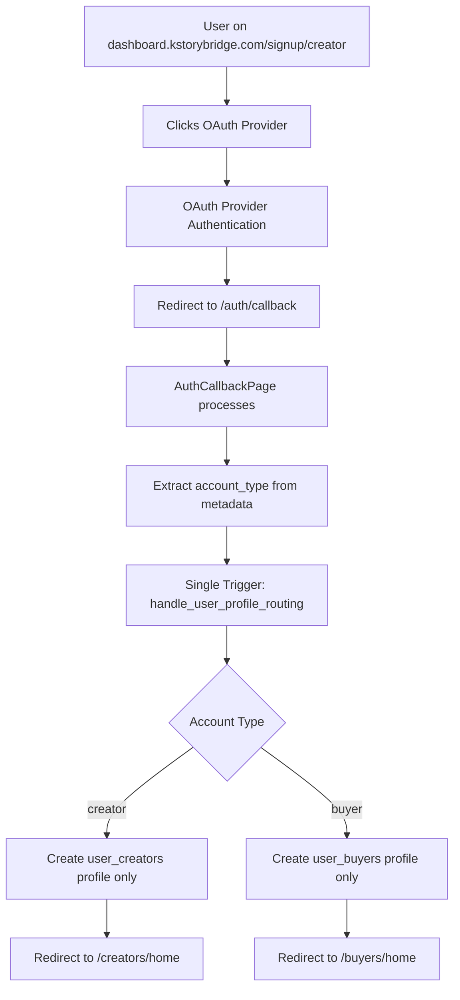

# Authentication Architecture Documentation

**Last Updated:** September 10, 2025  
**Version:** 2.0 - Post Account Type Standardization & Trigger Consolidation

## 🏗️ Architecture Overview

KStoryBridge uses a **split-app architecture** for authentication with standardized account types and consolidated database triggers.

### **Website App** (Marketing)
- **URL**: `localhost:5173` (dev) / `kstorybridge.com` (prod)
- **Purpose**: Marketing pages, public content, creator showcases
- **Auth Role**: Redirects to Dashboard app for all authentication
- **No Auth Pages**: Contains no signup/signin pages - all auth handled by Dashboard

### **Dashboard App** (Authentication + Application)  
- **URL**: `localhost:8081` (dev) / `dashboard.kstorybridge.com` (prod)
- **Purpose**: Complete authentication system AND authenticated user dashboard
- **Auth Pages**: Contains all authentication pages and flows
- **Protected Routes**: Account-type-specific routing with protection middleware

## 🔄 Authentication Flow (Updated 2025-09-10)

### Standard Email/Password Flow
```mermaid
flowchart TD
    A[User visits kstorybridge.com] --> B[Clicks Sign Up/Sign In]
    B --> C[Redirected to dashboard.kstorybridge.com]
    C --> D{Choose Account Type}
    D -->|Buyer| E[/signup/buyer]
    D -->|Creator| F[/signup/creator]
    E --> G[Email/Password Form]
    F --> H[Email/Password Form]
    G --> I[Create user_buyers profile]
    H --> J[Create user_creators profile]
    I --> K[Redirect to /buyers/home]
    J --> L[Redirect to /creators/home]
```

### OAuth Flow (Consolidated Triggers)


## 🎯 Account Type System (Standardized 2025-09-10)

### **Account Types** ✅
- **buyer**: `account_type: 'buyer'` → Routes to `/buyers/home`
- **creator**: `account_type: 'creator'` → Routes to `/creators/home`

### **Legacy Types** ❌ (Deprecated)
- ~~ip_owner~~ → Automatically converted to `creator`

### **Account Type Detection Priority**
1. **User Metadata** (highest priority - OAuth flows)
2. **Database Profile Lookup** (existing users)
3. **URL Parameters** (signup flows)
4. **SessionStorage Fallback** (OAuth edge cases)
5. **Default to 'buyer'** (backward compatibility)

## 🗄️ Database Schema & Structure

### **User Profile Tables**

#### `user_buyers` - Buyer Accounts
```sql
CREATE TABLE public.user_buyers (
  id uuid PRIMARY KEY REFERENCES auth.users(id),
  email text NOT NULL UNIQUE,
  full_name text NOT NULL,
  buyer_company text,
  buyer_role buyer_role, -- enum: producer, executive, agent, content_scout, other
  linkedin_url text,
  tier user_tier DEFAULT 'basic', -- basic, invited, pro, suite
  created_at timestamptz DEFAULT now(),
  updated_at timestamptz DEFAULT now()
);
```

#### `user_creators` - Creator Accounts
```sql
CREATE TABLE public.user_creators (
  id uuid PRIMARY KEY REFERENCES auth.users(id),
  email text NOT NULL UNIQUE,
  full_name text NOT NULL,
  pen_name text, -- ✅ IMPORTANT: Always use pen_name field
  ip_owner_role ip_owner_role, -- enum: author, agent
  ip_owner_company text,
  website_url text,
  invitation_status text DEFAULT 'invited', -- invited, accepted
  created_at timestamptz DEFAULT now(),
  updated_at timestamptz DEFAULT now()
);
```

### **Tier System (Buyers)**
- **Hierarchy**: `basic` (1) < `invited` (0) < `pro` (2) < `suite` (3)
- **Default for New Signups**: `basic` (changed from `invited` in 2025-08-21)
- **Access Control**: Implemented via `useTierAccess()` hook and `TierGatedContent` component

### **Database Triggers (Consolidated 2025-09-10)**

#### **Single Consolidated Trigger**
```sql
-- Replaces multiple competing triggers
CREATE TRIGGER on_auth_user_profile_routing
  AFTER INSERT ON auth.users
  FOR EACH ROW 
  EXECUTE FUNCTION public.handle_user_profile_routing();
```

#### **Trigger Function Logic**
```sql
CREATE OR REPLACE FUNCTION public.handle_user_profile_routing()
RETURNS TRIGGER AS $$
BEGIN
  -- Extract account_type from user metadata
  account_type_value := NEW.raw_user_meta_data->>'account_type';
  
  IF account_type_value = 'buyer' THEN
    -- Create ONLY buyer profile (with duplicate prevention)
    INSERT INTO public.user_buyers (...) VALUES (...);
    
  ELSIF account_type_value = 'creator' THEN
    -- Create ONLY creator profile (with duplicate prevention)
    INSERT INTO public.user_creators (...) VALUES (...);
    
  ELSIF account_type_value = 'ip_owner' THEN
    -- Legacy support: map ip_owner to creator
    INSERT INTO public.user_creators (...) VALUES (...);
  END IF;
  
  RETURN NEW;
END;
$$;
```

### **RLS Policies**
```sql
-- user_buyers policies
CREATE POLICY "Users can view own buyer profile" ON user_buyers
  FOR SELECT USING (auth.uid() = id);

CREATE POLICY "Users can insert own buyer profile" ON user_buyers  
  FOR INSERT WITH CHECK (auth.uid() = id);

-- user_creators policies  
CREATE POLICY "Users can view own creator profile" ON user_creators
  FOR SELECT USING (auth.uid() = id);

CREATE POLICY "Users can insert own creator profile" ON user_creators
  FOR INSERT WITH CHECK (auth.uid() = id);

-- Service role bypass for triggers
CREATE POLICY "Allow trigger inserts" ON user_creators
  FOR INSERT TO authenticated, service_role WITH CHECK (true);
```

## 🔐 Authentication Implementation

### **Component Architecture**

#### **Route Protection Hierarchy**
```typescript
// 1. Base Authentication
<ProtectedRoute> // Requires valid user session
  
  // 2. Account Type Protection  
  <AccountTypeProtectedRoute allowedAccountTypes={['creator']}>
    
    // 3. Layout with Navigation
    <CMSLayout>
      {children}
    </CMSLayout>
    
  </AccountTypeProtectedRoute>
</ProtectedRoute>
```

#### **Account Type Detection Hook**
```typescript
// Centralized account type detection with caching
export function useAccountType(options: AccountTypeOptions = {}) {
  const { user } = useAuth();
  
  // Returns: { accountType, loading, source, confidence, profileExists }
  return {
    accountType: 'creator' | 'buyer' | null,
    loading: boolean,
    source: 'metadata' | 'database_buyer' | 'database_creator' | 'url_params' | 'default',
    confidence: 'high' | 'medium' | 'low',
    profileExists: boolean
  };
}
```

### **Authentication Pages & Routes**

#### **Dashboard App Routes**
```typescript
// Authentication routes (no auth required)
/signin                   // SigninPage.tsx
/signup                   // SignupPage.tsx (redirects to specific type)
/signup/buyer            // BuyerSignupPage.tsx
/signup/creator          // CreatorSignupPage.tsx  
/forgot-password         // ForgotPasswordPage.tsx
/auth/callback          // AuthCallbackPage.tsx (OAuth handler)

// Protected buyer routes
/buyers/home            // Buyer dashboard
/buyers/titles          // Title browsing
/buyers/favorites       // Saved titles
/buyers/requests        // Purchase requests

// Protected creator routes  
/creators/home          // Creator dashboard (simplified - no search/title count)
/creators/titles        // Creator's own titles (simplified - no search/filters)
/creators/titles/add    // Add new title
/creators/profile       // Profile management
```

### **Cross-App Navigation**

#### **Website → Dashboard Redirects**
```typescript
// Website uses environment variables for dashboard URLs
const DASHBOARD_URL = import.meta.env.VITE_DASHBOARD_URL || 'http://localhost:8081';

// Navigation patterns from website
{
  'Sign Up (General)': `${DASHBOARD_URL}/signup`,
  'Sign Up as Creator': `${DASHBOARD_URL}/signup/creator`, 
  'Sign Up as Buyer': `${DASHBOARD_URL}/signup/buyer`,
  'Sign In': `${DASHBOARD_URL}/signin`,
  'Access Dashboard': `${DASHBOARD_URL}/` // Auto-routes based on account type
}
```

## 🔧 Edge Functions & Services

### **create-creator-profile**
- **Purpose**: Creates `user_creators` records during OAuth flows
- **Location**: `supabase/functions/create-creator-profile/index.ts`
- **Authentication**: Uses service role to bypass RLS
- **Usage**: Called by AuthCallbackPage for creator OAuth completions
- **Duplicate Prevention**: Checks for existing profiles before creation

#### **Edge Function Flow**
```typescript
// Called from AuthCallbackPage.tsx
const response = await supabase.functions.invoke('create-creator-profile', {
  body: {
    userId: user.id,
    email: user.email,
    fullName: user.user_metadata?.full_name,
    penName: user.user_metadata?.pen_name,
    ipOwnerRole: user.user_metadata?.ip_owner_role,
    ipOwnerCompany: user.user_metadata?.ip_owner_company,
    websiteUrl: user.user_metadata?.website_url
  }
});
```

## 🧪 Development & Testing Setup

### **Environment Configuration**

#### **Website `.env.local`**
```bash
VITE_DASHBOARD_URL=http://localhost:8081
VITE_WEBSITE_URL=http://localhost:5173
```

#### **Dashboard `.env.local`**  
```bash
VITE_DASHBOARD_URL=http://localhost:8081
VITE_WEBSITE_URL=http://localhost:5173

# Development flags
VITE_LOCAL_TESTING=true
VITE_OAUTH_TESTING=true  
VITE_AUTH_DEBUG=true

# Supabase configuration
VITE_SUPABASE_URL=https://dlrnrgcoguxlkkcitlpd.supabase.co
VITE_SUPABASE_ANON_KEY=eyJhbGciOiJIUzI1NiIsInR5cCI6IkpXVCJ9...

# Optional: Local Supabase
# VITE_SUPABASE_URL=http://localhost:54321
# VITE_SUPABASE_ANON_KEY=<local-anon-key>
```

### **OAuth Provider Configuration**

#### **Supabase Auth Settings**
- **Site URL**: `http://localhost:8081` (dev) / `https://dashboard.kstorybridge.com` (prod)
- **Redirect URLs**:
  - `http://localhost:8081/auth/callback`
  - `https://dashboard.kstorybridge.com/auth/callback`
- **OAuth Providers**: Google, GitHub (configured in Supabase dashboard)

### **Local Testing Scenarios**

#### **Test 1: Buyer Email Signup**
```bash
# Start both apps
npm run dev:website    # localhost:5173
npm run dev:dashboard  # localhost:8081

# Test flow
1. Visit: http://localhost:5173
2. Click "Sign Up" 
3. Redirected to: http://localhost:8081/signup/buyer
4. Complete email signup
5. Profile created in user_buyers table
6. Redirected to: http://localhost:8081/buyers/home
```

#### **Test 2: Creator OAuth Signup**
```bash
# Test flow  
1. Visit: http://localhost:5173/creators
2. Click "Join as Creator"
3. Redirected to: http://localhost:8081/signup/creator
4. Click "Continue with Google"
5. OAuth flow → /auth/callback
6. Single trigger creates ONLY creator profile
7. Redirected to: http://localhost:8081/creators/home
```

#### **Test 3: Account Type Detection**
```bash
# Debug account type detection
1. Enable VITE_AUTH_DEBUG=true
2. Check browser console for logs:
   - 🔍 [AccountType] Starting account type detection
   - ✅ Found valid account type in metadata
   - 📋 Profile verification result: EXISTS/NOT FOUND
```

## 🐛 Issues Fixed & Solutions Applied

### **1. Infinite Loading Loop (Fixed 2025-09-10)**
- **Issue**: `useAccountType` hook caused infinite re-renders
- **Root Cause**: Unstable dependencies in useEffect
- **Solution**: Destructured options, added timeout protection, stable dependencies

### **2. Duplicate Profile Creation (Fixed 2025-09-10)**
- **Issue**: Creator OAuth created profiles in BOTH user_buyers AND user_creators
- **Root Cause**: Multiple competing triggers firing simultaneously
- **Solution**: Consolidated to single trigger with duplicate prevention

### **3. RLS Policy Blocking (Fixed 2025-09-10)**  
- **Issue**: Database triggers couldn't create profiles due to RLS
- **Root Cause**: Missing service role policies for trigger operations
- **Solution**: Added service role bypass policies for trigger functions

### **4. Account Type Mismatch (Fixed 2025-09-10)**
- **Issue**: Frontend used 'creator' but triggers expected 'ip_owner'
- **Root Cause**: Legacy account type references in database functions
- **Solution**: Updated all triggers to use standardized 'creator' account type

## 📁 File Structure & Code Organization

### **Dashboard App (Authentication)**
```
apps/dashboard/src/
├── pages/
│   ├── SigninPage.tsx              # Email/password signin
│   ├── SignupPage.tsx              # Account type selection redirect
│   ├── BuyerSignupPage.tsx         # Buyer signup flow
│   ├── CreatorSignupPage.tsx       # Creator signup flow  
│   ├── AuthCallbackPage.tsx        # OAuth callback processor
│   └── ForgotPasswordPage.tsx      # Password reset
├── components/
│   ├── ProtectedRoute.tsx          # Base auth protection
│   ├── AccountTypeProtectedRoute.tsx # Account type routing
│   ├── BuyerProtectedLayout.tsx    # Buyer route wrapper
│   ├── CreatorProtectedLayout.tsx  # Creator route wrapper
│   └── SessionTracker.tsx          # Session monitoring
├── hooks/
│   ├── useAuth.tsx                 # Authentication state management
│   └── useTierAccess.tsx          # Buyer tier access control
├── utils/
│   ├── accountTypeDetection.ts     # Account type detection logic
│   └── navigation.ts              # Cross-app navigation helpers
└── contexts/
    └── TierContext.tsx            # Tier-based access provider
```

### **Database Structure**
```
supabase/
├── migrations/                     # Database schema changes
│   ├── 20250910-fix-duplicate-creator-profiles.sql # Trigger consolidation
│   ├── 20250910-fix-user-creators-rls-policies.sql # RLS fixes
│   └── 20250821000000-update-tier-default-to-basic.sql
├── functions/
│   └── create-creator-profile/     # Creator profile creation
│       └── index.ts
└── config.toml                    # Supabase configuration
```

## 🔍 Debugging & Monitoring

### **Debug Logging**
```typescript
// Enable comprehensive auth debugging
localStorage.setItem('auth_debug', 'true');

// Console output includes:
// 🔍 [AccountType] Starting account type detection
// 📋 Profile verification result: EXISTS
// 🛡️ Account type protection check: ALLOWED
// ✅ Found valid account type in metadata
```

### **Common Debug Queries**
```sql
-- Check user account type and profiles
SELECT 
  au.email,
  au.raw_user_meta_data->>'account_type' as metadata_type,
  CASE WHEN ub.id IS NOT NULL THEN 'YES' ELSE 'NO' END as has_buyer_profile,
  CASE WHEN uc.id IS NOT NULL THEN 'YES' ELSE 'NO' END as has_creator_profile
FROM auth.users au
LEFT JOIN user_buyers ub ON ub.id = au.id  
LEFT JOIN user_creators uc ON uc.id = au.id
WHERE au.email = 'test@example.com';

-- Check active database triggers
SELECT trigger_name, event_object_table, action_statement
FROM information_schema.triggers 
WHERE event_object_table = 'users' AND trigger_schema = 'auth';

-- Find duplicate profiles
SELECT uc.email, 'DUPLICATE' as issue
FROM user_creators uc
INNER JOIN user_buyers ub ON uc.id = ub.id;
```

## 📊 Performance Optimizations

### **Tier System Optimization**
- **Problem**: Each `TierGatedContent` made individual database queries
- **Solution**: Centralized `TierProvider` context with single query
- **Performance Gain**: 70-80% faster loading, 99% reduction in database queries

### **Account Type Caching**  
- **Implementation**: `useAccountType` hook with memoization
- **Cache Duration**: Session-based, clears on logout
- **Fallback**: Graceful degradation with default account type

## 🚀 Deployment Considerations

### **Environment Variables** 
```bash
# Production Dashboard
VITE_DASHBOARD_URL=https://dashboard.kstorybridge.com
VITE_WEBSITE_URL=https://kstorybridge.com
VITE_SUPABASE_URL=https://dlrnrgcoguxlkkcitlpd.supabase.co
VITE_SUPABASE_ANON_KEY=<production-anon-key>

# Production Website  
VITE_DASHBOARD_URL=https://dashboard.kstorybridge.com
VITE_WEBSITE_URL=https://kstorybridge.com
```

### **Database Migration Strategy**
1. **Apply trigger consolidation migration**
2. **Test account type detection** 
3. **Verify no duplicate profile creation**
4. **Monitor performance metrics**
5. **Rollback plan**: Keep old trigger functions commented

## 📝 Key Principles & Best Practices

### **Authentication Design Principles**
1. **Single Source of Truth**: Dashboard app handles all authentication
2. **Account Type Consistency**: Use 'buyer' and 'creator' only
3. **Database Trigger Reliability**: One trigger, duplicate prevention, error handling
4. **Performance First**: Minimize database queries, cache account types
5. **Security by Default**: RLS policies, service role separation, input validation

### **Development Guidelines**
1. **Always use `pen_name` field** for creator profiles (not legacy field names)
2. **Test account type detection** with debug logging enabled
3. **Verify single profile creation** for OAuth flows
4. **Use standardized account types** in all new code
5. **Monitor performance** of tier-based components

### **Future Considerations**
- **Multi-tenant Support**: Architecture ready for multiple organizations
- **Advanced Tier Features**: Granular permissions within tiers
- **Analytics Integration**: Enhanced user journey tracking
- **Mobile App Support**: OAuth flow adaptations for mobile

---

**This document reflects the current state as of September 10, 2025, including all major fixes for duplicate profile creation, infinite loading, and account type standardization.**