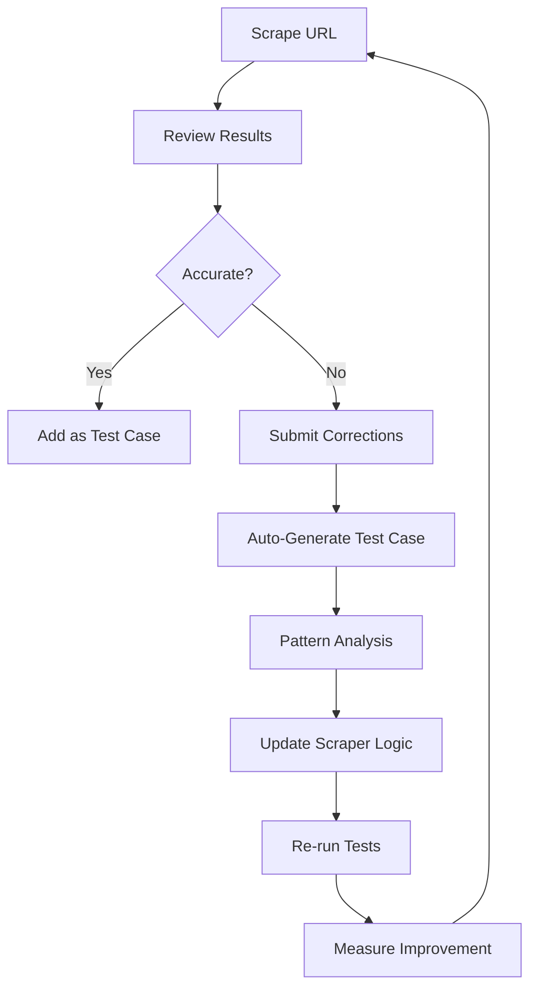

# 🧪 Scraper Testing & Feedback Loop System

## Overview

This comprehensive system enables continuous improvement of scraper accuracy through automated testing and user feedback collection. The system creates a feedback loop where corrections become training data, leading to measurable accuracy improvements.

## 🏗️ Architecture

### Components

1. **ScraperTestSuite** (`src/tests/scraperTestSuite.js`)
   - Manages test cases and executes comprehensive testing
   - Calculates field-level accuracy scores
   - Generates actionable improvement recommendations

2. **FeedbackService** (`src/services/feedbackService.js`)
   - Collects user corrections from admin interface
   - Automatically generates test cases from high-confidence feedback
   - Analyzes patterns to identify systematic issues

3. **Testing API** (`src/routes/testing.js`)
   - REST endpoints for test management and feedback submission
   - Real-time accuracy monitoring
   - Integration with admin interface

4. **Enhanced Admin Interface** (`apps/admin/src/pages/AdminScraperTest.tsx`)
   - One-click feedback submission
   - Test case creation from validated data
   - Real-time accuracy improvement

## 🚀 Quick Start

### 1. Initialize Test Data
```bash
cd backend
npm run add-test-cases
```

### 2. Run Test Suite
```bash
npm run test-scraper
```

### 3. Start Servers
```bash
# Backend (Terminal 1)
npm run dev

# Admin Interface (Terminal 2)
cd ../apps/admin
npm run dev
```

### 4. Access Testing Interface
- Admin Interface: http://localhost:8082
- Navigate to "Scraper Test Lab"
- Test URLs and submit corrections

## 📊 Test-Feedback Loop Workflow

### Continuous Improvement Cycle



### Accuracy Measurement

The system calculates accuracy at multiple levels:

- **Field-Level Accuracy**: Exact matches, similarity scores, tolerance ranges
- **Platform-Level Accuracy**: Performance per content platform
- **Overall System Accuracy**: Weighted average across all test cases

## 🎯 Usage Examples

### Example 1: Testing a New URL

```bash
# Via API
curl -X POST http://localhost:3001/api/testing/quick-test \
  -H "Content-Type: application/json" \
  -d '{"url": "https://series.naver.com/comic/detail.series?productNo=123456"}'
```

### Example 2: Submitting Corrections

```javascript
// Via Admin Interface (automated)
const feedback = await fetch('/api/testing/feedback', {
  method: 'POST',
  body: JSON.stringify({
    url: 'https://series.naver.com/comic/detail.series?productNo=123456',
    originalData: { title_name_kr: 'Wrong Title', views: 0 },
    correctedData: { title_name_kr: 'Correct Title', views: 50000 }
  })
});
```

### Example 3: Running Comprehensive Tests

```bash
# Run all tests and generate report
npm run test-scraper

# Output:
# 🧪 KStoryBridge Scraper Test Runner
# =====================================
# 
# 📋 Running 8 test cases...
# 
# 🎯 Test Results Summary
# ========================
# Total Tests: 8
# ✅ Passed (≥80%): 6
# ⚠️  Warning (60-80%): 1  
# ❌ Failed (<60%): 1
# 📊 Average Accuracy: 84.2%
```

## 📈 Metrics & Monitoring

### Key Metrics Tracked

- **Overall Accuracy**: Percentage of fields extracted correctly
- **Platform Performance**: Accuracy breakdown by content platform
- **Field Success Rates**: Which fields are most/least reliable
- **Improvement Velocity**: How quickly accuracy improves over time

### API Endpoints

- `GET /api/testing/report` - Current accuracy status
- `POST /api/testing/run-all` - Execute full test suite
- `GET /api/testing/feedback/analysis` - Feedback pattern analysis
- `GET /api/testing/test-cases` - View all test cases

## 🔧 Configuration & Customization

### Adding New Test Cases

```javascript
// Programmatically
await testSuite.addTestCase(url, expectedData, {
  source: 'manual',
  difficulty: 'medium',
  platform: 'naver'
});

// Via Admin Interface
// 1. Scrape URL
// 2. Correct any errors
// 3. Click "Add as Test Case"
```

### Confidence Scoring

The system uses weighted confidence scoring:

```javascript
const weights = {
  title_name_kr: 0.3,    // High importance
  description: 0.15,
  author: 0.1,
  genre: 0.1,
  views: 0.08,
  // ... other fields
};
```

### Accuracy Thresholds

- **✅ Passed**: ≥80% accuracy
- **⚠️ Warning**: 60-80% accuracy  
- **❌ Failed**: <60% accuracy

## 💡 Best Practices

### For Test Case Creation

1. **Diverse Platforms**: Include examples from all supported platforms
2. **Edge Cases**: Test unusual formats, special characters, missing data
3. **Validation**: Always verify expected data manually before adding
4. **Metadata**: Include difficulty and source information

### For Feedback Submission

1. **Immediate Corrections**: Submit feedback as soon as errors are found
2. **Complete Data**: Ensure all corrected fields are accurate
3. **Context**: Include relevant metadata about the correction
4. **Verification**: Double-check corrections before submission

### For Continuous Improvement

1. **Regular Testing**: Run full test suite weekly
2. **Pattern Analysis**: Review feedback patterns monthly
3. **Targeted Improvements**: Focus on lowest-scoring fields first
4. **Performance Monitoring**: Track accuracy trends over time

## 🚨 Troubleshooting

### Common Issues

**Low Test Accuracy**
- Check if scraper patterns need updating
- Verify test cases have correct expected data
- Review platform-specific extraction logic

**Feedback Not Working**
- Ensure backend server is running on port 3001
- Check CORS configuration for admin interface
- Verify feedback data format matches API expectations

**Test Suite Fails**
- Check network connectivity to content platforms
- Verify all test URLs are still valid
- Review timeout and retry configuration

## 📋 Future Enhancements

### Planned Features

1. **Machine Learning Integration**: Use feedback data to train ML models
2. **Automated Pattern Detection**: Identify new extraction patterns automatically
3. **Performance Benchmarking**: Compare against previous versions
4. **Real-time Monitoring**: Live accuracy dashboard
5. **A/B Testing**: Test scraper improvements before deployment

### Contributing

To contribute to scraper accuracy:

1. Use the admin interface to submit corrections
2. Add challenging test cases for edge cases
3. Report systematic issues through feedback analysis
4. Suggest new extraction patterns based on patterns

---

## 📞 Support

For questions about the testing system:

- Check test logs in `backend/test-results/`
- Review feedback data in `backend/feedback-data/`
- Monitor API endpoints for real-time status
- Submit issues through the admin interface feedback system

The test-feedback loop system is designed to continuously improve scraper accuracy through systematic measurement and user feedback. Regular use of this system will lead to measurable improvements in data extraction quality.