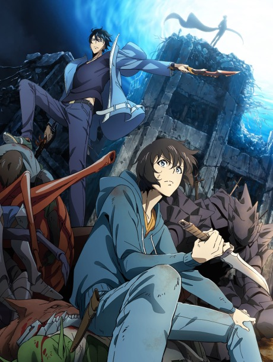
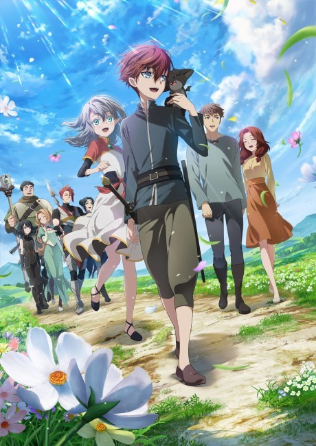
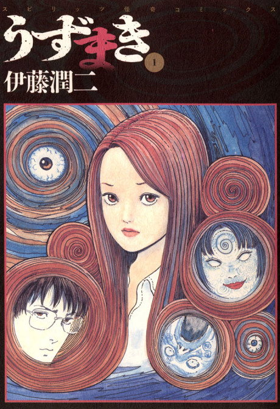
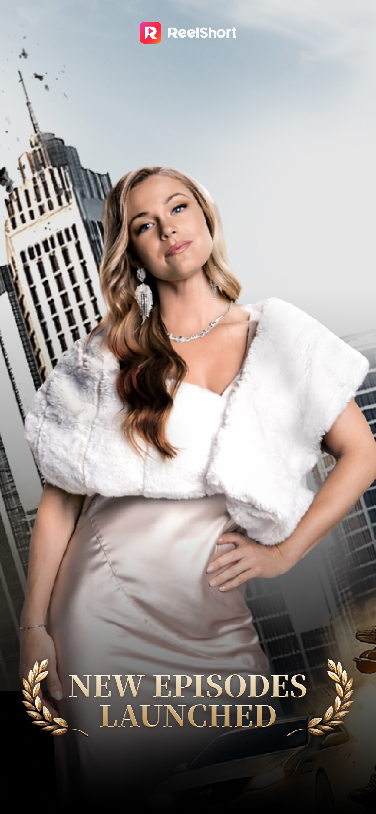
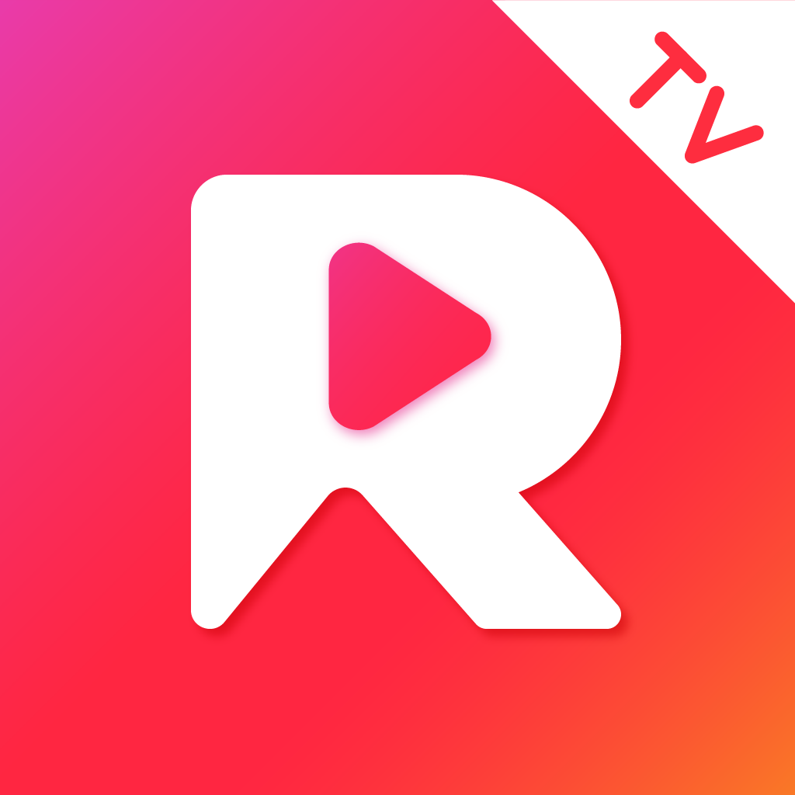
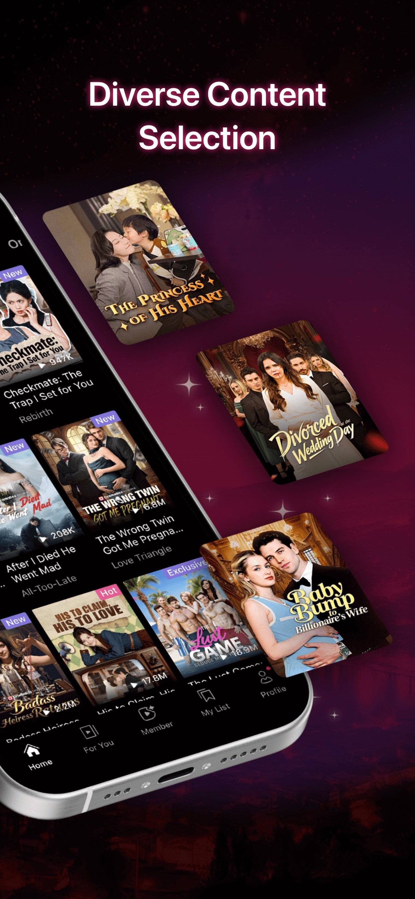
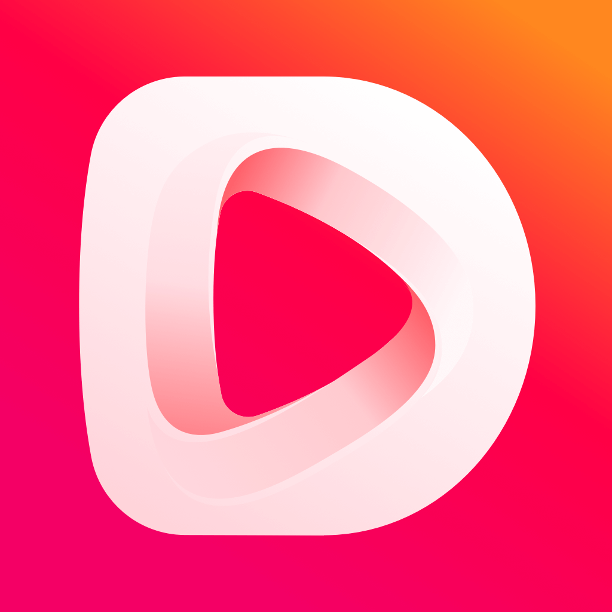
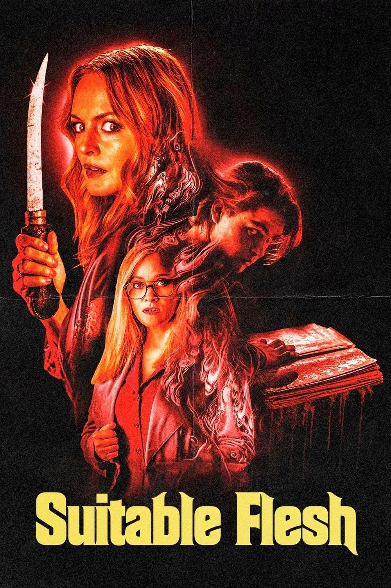
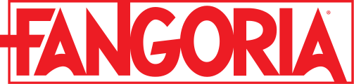

# KStoryBridge Creator Deck v6

> Sister deck (English): [kstorybridge-creator-intro-EN-V1(4:26:2026).md](./kstorybridge-creator-intro-EN-V1%284:26:2026%29.md) · Deployed at [/intro/en](https://kstorybridge.com/intro/en) · This deck deploys at [/intro/kr](https://kstorybridge.com/intro/kr). Keep the two in sync when editing.

## Audience
Korean creators evaluating whether KStoryBridge is a trustworthy way to present their work to US and global producers.

## Design Direction
- Cover / transition / CTA: v5 Global Stage
- Empathy and trust slides: v2 Warm Publishing
- Proof slides: restrained editorial-tech clarity

## Slide 1. Cover
**이제 당신의 스토리가
더 넓은 세상과 만날 차례입니다**

한국 스토리텔러를 위한 KStoryBridge의 제안

**Visual note:** half-bleed warm illustration on the right (Korean creator's window framing a Hollywood horizon), toned down and softly edged into the cream page so the headline carries the slide.

---

## Slide 2. 현실 공감
*Eyebrow: 01 · 현실 공감*

**훌륭한 스토리들은 많이 있지만,
의미있는 연결은 아직 부족합니다**

팬도 있고 반응도 있습니다.
하지만 해외 업계에 작품이 소개되고
영상화되는 기회는 많지 않습니다.

**지금 여러분의 훌륭한 이야기에 필요한 건
제대로된 연결을 도와줄 파트너입니다.**

**Visual note:** half-bleed creator-at-desk illustration on the right, mirroring slide 1's treatment (toned down, soft inner edge fading into the page).

---

## Slide 3. 왜 기존 방식이 아쉬울까
*Eyebrow: 02 · 왜 기존 방식이 아쉬울까*

**지금의 방식들은
창작자에게 너무 많은 부담이 됩니다**

Three-card grid:

**01 · 콜드메일 - 거의 읽히지 않는 콜드메일**
수백 통 중 한 통.
언어와 맥락의 벽 앞에서
대부분은 답 없이 끝납니다.

**02 · 에이전트 - 연락도 어렵고 비용도 큰 에이전트**
접근부터 쉽지 않고,
비용 부담도 큽니다.
협상의 여지가 좁아집니다.

**03 · 필름 마켓 - 한 번에 수백만 원, 보장은 없는 마켓**
참가비는 큰데
누가 봐줄지는 알 수 없고,
후속도 혼자 감당해야 합니다.

좋은 작품이 있어도, **기회를 찾기는 쉽지 않습니다.**

---

## Slide 4. 전환
**지금 필요한 건,

해외 제작자들이 원하는 방식으로 *검토받을 수 있게*
당신의 작품을 *정확히 이해하고*
도와주는 *파트너*입니다**

**Visual note:** centered headline only, porcelain background, key phrases highlighted in teal.

---

## Slide 5. KStoryBridge가 하는 일
*Eyebrow: 03 · KStoryBridge가 하는 일*

**한국의 스토리들이 글로벌 시장에서
제대로 검토받게 만듭니다**

등록에서 끝나지 않고,
**실제 검토와 후속 대화로 이어지게 만듭니다.**

Right column - three numbered items:

**01. 글로벌 포맷으로 재구성** - 피치덱, Comps(비교작 분석), 포맷 적합도 분석
**02. 결정권자에게 직접 연결** - 넷플릭스·디즈니·아마존·소니 담당자
**03. 진행 과정의 투명한 공유** - 검토자·피드백·다음 단계를 정기 보고

---

## Slide 6. 왜 KStoryBridge인가
*Eyebrow: 04 · 왜 KStoryBridge인가*

**한국 창작자들의 편에서 일하면서
할리우드를 깊이 이해하는 든든한 파트너입니다**

Three trust cards:

**신뢰 · Trust - 한국 작가의 편에서 출발합니다**
한국 작가의 권리와 입장에서 시작합니다.
권리를 양도하지 않아도,
작품을 세계에 보여드릴 수 있습니다.

**전문성 · Expertise - 오랜 할리우드 프로젝트 개발 경험**
Kevin은 Crunchyroll 애니메이션
《The Beginning After The End》의
Executive Producer입니다.

**경험 · Experience - 글로벌 IP를 직접 다뤄온 팀**
Netflix, Wolper/WB, RIDI, Tapas 등에서
글로벌 IP를 직접 다뤘습니다.
한국과 글로벌 시장 양쪽을 모두 이해합니다.

---

## Slide 7. 우리는 누구인가
*Eyebrow: 05 · 우리는 누구인가*

**할리우드와 한국, 두 세계를 매일 살아온
두 사람이 직접 만든 회사입니다**

Two founder cards (with photos):

**Kevin Nicklaus (케빈 니클라우스)**
Co-Founder · 할리우드 IP 어댑테이션 20년
- Warner Bros. (Wolper Org) **SVP, Development**
- Executive Producer, *The Beginning After The End* (Crunchyroll · Fuji TV)
- Executive Producer, *이토 준지의 피를 마시는 어둠(Bloodsucking Darkness)* (Fangoria)
- Consulting Producer · **Tapas Media · RIDI/Manta**
- [프로필 보기 →](https://www.linkedin.com/in/kevin-nicklaus/)

**Sungho Lee (이성호)**
Co-Founder · 한국-글로벌 커넥터 20년
- **Netflix** 아시아 사업개발 디렉터
- **RIDI / Manta** IP확장 및 할리우드 진출 총괄
- 모바일 · 소프트웨어 · OTT 글로벌 사업 20년
- Cornell Johnson MBA
- [프로필 보기 →](https://www.linkedin.com/in/sungholee/)

---

## Slide 8. 양방향의 다리
*Eyebrow: 05 · 양방향의 다리*

**작품을 지키는 일과
세계에 닿게 만드는 일은
같은 작업입니다**

한국식으로만 접근하면, 미국 제작자들이
이해할 수 있는 문화적 언어로 풀어내기 어렵습니다.
미국식으로만 접근하면, 핵심 컨셉만 가져가고
작품을 위대하게 만드는 디테일을 잃기 쉽습니다.

KStoryBridge는 양쪽 모두를 들여다보고 이어줍니다.
**원작의 본질은 지키고,**
**해외 시장이 받아들일수 있게 다듬습니다.**

> 최근 한국 원작을 미국 시장용 트리트먼트로 옮기면서,
> 원작자도 놀랄 방식으로 스토리라인을 그대로 지켰습니다.
> 동시에 캐스팅과 예산 같은 제작 현실을 고려해서 원작자라면
> 떠올리지 못했을 각색의 방향을 잡아서 진행시켰습니다.

**Visual note:** v2 Warm Publishing treatment. 우측에 두 컬럼 다이어그램 - 좌측 "원작의 본질," 우측 "해외 시장의 언어," 두 컬럼을 잇는 부드러운 브릿지 선. 풀쿼트는 본문 아래에 가벼운 무게로, 사례가 아닌 예시로 명확히 프레이밍.

---

## Slide 9. 할리우드 제작자들에게 작품을 소개하는 방식
*Eyebrow: 06 · 할리우드 제작자들에게 작품을 소개하는 방식*

**할리우드 제작자들은
당신의 작품을 이렇게 보게 됩니다**

KStoryBridge에서는 작품이 단순히 등록되는 데서 끝나지 않습니다.
프로듀서가 빠르게 이해하고 검토할 수 있도록
**핵심 정보와 매력이 더 분명하게 정리**됩니다.

- 한눈에 읽히는 시놉시스
- AI 비교작 분석 - 할리우드 임원이 "성공"으로 인식하는 작품과의 연결고리
- 포맷 적합도 · 타겟 마켓 같은 개발 관점 분석
- 실제 검토와 후속 대화로 이어지는 구조

**Visual layout:** the right side shows a thumbnail of the full producer-facing page on the left with three highlighted zones (teal / coral / teal), connected by dashed arrows to three larger slice cards on the right:

- **Synopsis** - 한눈에 읽힙니다
- **AI Comps** - 할리우드 임원의 mandate와 맞닿는 비교작
- **Format Fit** - 개발 관점 분석

**Proof source:** `Does Love Need a Translator?` producer-facing detail page screenshot, sliced into three highlighted sections.

---

## Slide 10. 피칭은 이렇게 진행됩니다
*Eyebrow: 07 · 피칭은 이렇게 진행됩니다*

**작품을 시장에
제대로 선보이는
단계별 과정입니다**

그저 등록하고 기다리는 게 아닙니다.
덱 제작부터 미팅 진행까지
**한 작품을 끝까지 책임**지고 끌고 갑니다.

Four-step vertical flow:

**01. 피치덱 직접 제작**
Kevin의 30년 할리우드 경험을 바탕으로
작품에 맞는 피치덱을 **직접 제작**합니다.

**02. 맞춤형 피치 전략**
스튜디오와 제작사의 **mandate(제작 방향)**를
고려해 어디로, 어떻게 가져갈지 설계합니다.

**03. 관심도 사전 확인**
직접 미팅과 콜을 통해
**실제 관심이 있는 곳**만 추려냅니다.

**04. 공식 피치 미팅 진행**
의사결정권자와의 공식 미팅에서
피치를 **직접 진행**합니다.

---

## Slide 11. 누가 KStoryBridge를 사용하고 있을까
*Eyebrow: 08 · 누가 KStoryBridge를 사용하고 있을까*

**유수의 할리우드 제작자들이 그들의 다음 작품을
KStoryBridge에서 검토하고 있습니다**

[Studio logo wall - Netflix, Walt Disney Studios, Sony Pictures, Crunchyroll, Amazon Studios, Warner Bros, Paramount, 50+ Hollywood studios and global streamers]

KStoryBridge는 미국과 글로벌 시장의 프로듀서들이
**익숙한 방식으로 한국 IP를 검토할 수 있게** 돕습니다.

중요한 건 많이 보여지는 것이 아니라, **적절한 담당자에게 제대로 보여지는 것입니다.**

**Proof source:** customer / producer logos from `https://kstorybridge.com/creators`

---

## Slide 12. CTA
**이제 당신의 스토리가
세계와 만날 시간입니다!**

그 시작을 저희가 함께 고민해드립니다.
작품의 가능성에 대한 **대화를 원하세요?**

▶ **이메일로 연락하기**
partners@kstorybridge.com (클릭하면 복사됨)

링크: https://kstorybridge.com/creators

**Visual note:** ink (dark) background, full-bleed CTA, primary + ghost button pair.

---

<!-- _class: lead -->

## Slide 13. 부록

# 부록

### 이 덱에 등장하는 글로벌 파트너, 작가, 작품을 짧게 소개합니다

한국 창작자에게 익숙하지 않은 이름들이 본문에 등장합니다.
앞 페이지의 맥락을 채울 수 있도록 한 페이지씩 정리했습니다.

**Visual note:** centered lead-style cover, soft teal/coral gradient at corners (matches Slide 1). No eyebrow number on this divider slide.

---

## Slide 14. Crunchyroll (크런치롤)
*Eyebrow: 부록 · 01 · 애니메이션 · Crunchyroll*

**소니가 소유한 세계 최대 애니메이션 스트리밍**

2006년 미국에서 시작해 2021년 소니가 약 **11.75억 달러**에 인수한 글로벌 애니메이션 전문 플랫폼입니다. 일본 작품 중심에서 출발했지만, 지금은 한국·중국·미국 원작 IP가 글로벌 시장으로 가는 핵심 통로입니다.

**규모 (Scale)**
- 유료 구독자: **2천백만+ (2026 기준)**
- 라이브러리: 50,000+ 에피소드 / 25,000+ 시간
- 모기업: 소니 픽처스 엔터테인먼트

**한국 작가에게 의미하는 것**
> 한국 웹소설 원작 **《나 혼자만 레벨업》**은 크런치롤의 2024년 최대 흥행 애니메이션이 되었습니다. 한국 IP가 글로벌 시장으로 진입하는 가장 직접적이고 검증된 통로 중 하나입니다.

<!-- Visual: Crunchyroll wordmark (top-left) + Solo Leveling cover half-bleed right -->

---

## Slide 15. The Beginning After The End
*Eyebrow: 부록 · 02 · 애니메이션 · The Beginning After The End*

**미국 웹소설이 크런치롤 오리지널 애니메이션이 되기까지**

TurtleMe라는 **한국계 미국인 작가**가 2015년부터 무료 웹소설 사이트 Royalroad에 연재한 이세계물입니다. 2018년 Tapas에서 웹툰으로 확장되었고, 2025년 크런치롤 오리지널 애니메이션으로 제작되었습니다. **KStoryBridge의 Kevin이 본 작품의 Executive Producer입니다.**

**규모 (Scale)**
- 원작 웹소설: 529화 (2015–2025, Royalroad/Patreon)
- 웹툰: Tapas, 2018년부터 연재 중
- 애니메이션: 시즌 1 (2025.04) · 시즌 2 (2026.04), 크런치롤 오리지널

**한국 작가에게 의미하는 것**
> 일본이 아닌 지역의 웹 연재 원작이 정상급 애니메이션 IP로 확장된 정확한 사례입니다. **한국 웹소설·웹툰이 같은 경로를 밟을 수 있다는 검증된 모델**이며, 이 길을 직접 걸어본 사람이 KStoryBridge를 만들었습니다.

<!-- Visual: TBATE anime cover half-bleed right -->

---

## Slide 16. 이토 준지 (Junji Ito)
*Eyebrow: 부록 · 03 · 장르 IP · 이토 준지*

**서구가 인정한 일본 호러 만화의 거장**

《소용돌이(うずまき)》《토미에》《어둠의 목소리》로 알려진 일본 호러 만화가입니다. 미국 만화 산업의 최고 권위상인 **아이즈너상을 4회 수상**했고, 2025년 명예의 전당에 헌액되었습니다. **KStoryBridge의 Kevin이 이토 준지의 《피를 마시는 어둠》 실사화 프로젝트의 Executive Producer로 참여중입니다.**

**규모 (Scale)**
- Eisner Award: 4회 수상 (2019–2022) → 명예의 전당 (2025)
- Netflix 《Junji Ito Maniac: Japanese Tales of the Macabre》: 12화 (2023.01)
- Adult Swim 《Uzumaki》: 미니시리즈 (2024.09–10), Production I.G USA 제작

**한국 작가에게 의미하는 것**
> 아시아 호러 작가가 단순 라이선스를 넘어 **Netflix·Warner와 직접 작가 단위로 계약**할 수 있다는 증거입니다. 한국 호러 웹툰/웹소설 작가가 자신의 커리어 지도를 그릴 때 참고할 수 있는 가장 명확한 사례.

<!-- Visual: Uzumaki manga cover half-bleed right -->

---

## Slide 17. ReelShort (릴쇼트)
*Eyebrow: 부록 · 04 · 수직형 드라마 · ReelShort*

**미국에서 가장 큰 세로형 단편 드라마 앱**

1–2분짜리 세로형 드라마 에피소드를 모바일에서 마이크로 결제로 풀어보는 미국 플랫폼입니다. 2023년 11월 미국 앱스토어 **엔터테인먼트 카테고리 1위**에 올라 일시적으로 TikTok 다운로드를 추월했고, 모기업 Crazy Maple Studio는 **2024년 TIME100 Most Influential Companies**에 선정되었습니다.

**규모 (Scale)**
- 매출: **약 $700M (2025)**
- 누적 다운로드: 3,700만 (2024 초) → **3.7억+ (2025)**
- 모기업: Crazy Maple Studio (실리콘밸리 본사, 中 COL Group 49% 지분 투자)

**한국 작가에게 의미하는 것**
> 회귀, 재벌, 복수, 알파메일 — ReelShort가 가장 많이 쓰는 트로프가 **한국 웹소설이 이미 가장 잘 쓰는 트로프와 정확히 일치**합니다. 이미 익숙한 글의 형식이 새로 열린 글로벌 매출로 이어지는 시장입니다.

<!-- Visual: ReelShort wordmark (top-left) + app screenshot half-bleed right (vertical phone aesthetic) -->

---

## Slide 18. DramaBox (드라마박스)
*Eyebrow: 부록 · 05 · 수직형 드라마 · DramaBox*

**같은 포맷, 또 하나의 거대 바이어**

ReelShort와 동일한 세로형 단편 드라마 포맷에서 가장 큰 경쟁 플랫폼입니다. 2023년 4월 출시 이후 빠르게 성장해 2024년 **매출 $323M · 순이익 $10M**을 기록했고, 2025년 **Disney Accelerator** 코호트에 선정되었습니다.

**규모 (Scale)**
- 매출 / 순이익: **$323M / $10M (2024)**
- 글로벌 MAU: 5천만+ (2025), H1 평균 4,400만
- 모기업: 디안종 테크놀로지(中) · Singapore StoryMatrix 운영; Google Play Best of 2024 'Best for Fun' 수상 (HK·ID 등 일부 국가)

**한국 작가에게 의미하는 것**
> 같은 작품을 두 플랫폼에 동시에 제안할 수 있는 구조입니다. 단일 바이어가 아니라 **입찰 경쟁이 가능한 시장**이라는 뜻이며, 한국 IP 입장에서 협상 카드가 두 장이 됩니다.

<!-- Visual: DramaBox wordmark (top-left) + app screenshot half-bleed right (matches ReelShort slide series feel) -->

---

## Slide 19. Fangoria Studios (팡고리아 스튜디오)
*Eyebrow: 부록 · 06 · 장르 IP · Fangoria Studios*

**미국 호러의 가장 오래된 권위 브랜드**

Fangoria는 **1979년 창간**된 미국 호러 전문 잡지로, 호러 장르의 "오스카"라 불리는 **Chainsaw Awards**를 1992년부터 주관해온 브랜드입니다. Fangoria Studios는 같은 브랜드의 영화 제작·투자 부문입니다.

**규모 (Scale)**
- 모 브랜드 창간: **1979년** (Kerry O'Quinn & Norman Jacobs)
- Chainsaw Awards: 1992년부터, 미국 호러 최고 권위상
- 최근작 (Fangoria Presents): **《Suitable Flesh》** (감독 Joe Lynch · 제작 Barbara Crampton · 주연 Heather Graham, 2023)

**한국 작가에게 의미하는 것**
> 호러는 글로벌 시장에서 작가의 색을 **가장 진하게 인정해주는 장르**입니다. Fangoria라는 이름 자체가 장르 신뢰도이며, 한국 호러 IP가 미국 실사 제작으로 가장 빠르게 도착할 수 있는 자연스러운 첫 목적지입니다.

<!-- Visual: Fangoria wordmark (top-left) + Suitable Flesh poster half-bleed right -->

---

## Assembly Notes

### Screenshot choices
- Slide 8: use the `Does Love Need a Translator?` producer detail page
- Show the FULL page as a small thumbnail on the left with three zones highlighted (Synopsis / AI Comps / Format Fit)
- Connect each zone with a dashed arrow to a larger detail-slice card on the right
- Each detail slice gets a single pill callout (no body copy on the bubble)

### Logo proof
- Slide 10 uses one clean logo grid image (`assets/studio-logos.png`)
- Wrapped in a soft white card on the cream page
- Used as proof, not decoration

### Tone check
Every slide should feel:
- calm
- specific
- creator-protective
- premium
- non-salesy

### What to cut first if it feels long
1. second paragraph on slide 8
2. last line of slide 3
3. remove pitch-step 3 ("관심도 사전 확인") on slide 9 if a 3-step flow reads cleaner

### Structure changes from earlier draft
- Slide 2 image now half-bleeds to match slide 1 (was a 600×600 framed card)
- Slide 4 transition headline reordered: "검토받을 수 있게" line precedes "정확히 이해하고"
- Slide 7 added - "양방향의 다리" makes the protect-and-translate value prop explicit (per Kevin's feedback). Subsequent slides shifted down by one; eyebrow numbers re-sequenced.
- Slide 8 (was 7) proof layout switched from "screenshot + 3 callouts" to "page thumbnail + arrows + 3 detail slices"
- Slide 9 (was 8) added - full pitching-process flow (4 steps) was previously implicit
- Producers/logos slide is slide 10 (was 9); CTA is now slide 11
- Logo on every slide is the wordmark only ("KStoryBridge"), no K tile
- PDF export button + checklist modal added to every slide for in-deck PDF saving
